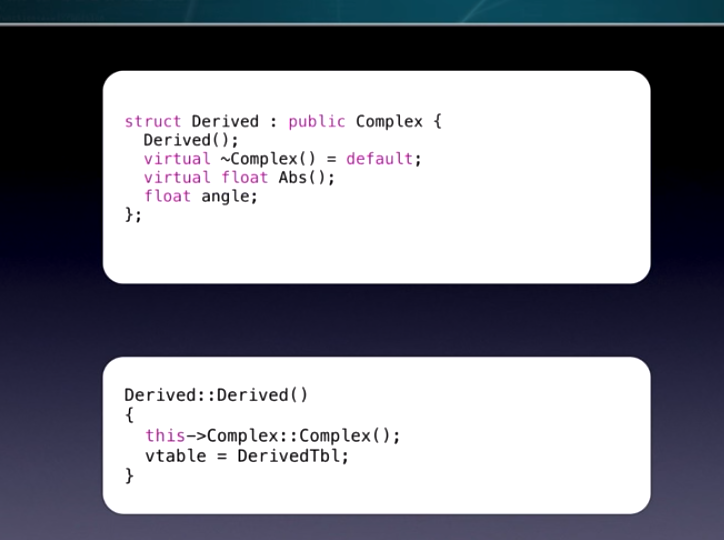

# C++ 对象模型简介

> 来源 https://www.youtube.com/watch?v=iLiDezv_Frk 的视频

## POD(plain old data)

c的内存布局, 字段从下到上占据从高到底位置的内存

## CPP

### 原始

这个是和 pod 等价的只是访问权限不同

### 简单继承

原因如下

### 带有函数

类是如何处理成员函数?

主要是增加一个参数 表示对象, 并且换了个名字, 所以 

### 虚函数 + 继承

编译器是如何处理这个的?

首先我们看这么一个调用

编译器会转换成如下的格式

1. 增加一个 vtable 的指针 指向一个 tbl 
2. 具体实现放入 tbl
3. 调用的时候通过 vtable 偏移 为 tbl 中函数所在的位置

当我们有个继承类的时候, 内存布局如下:

那我们怎么决定 vtable 指针的指向呢? 答案是靠 构造函数

每个构造函数里会添加:
1. 父类的构造
2. 修改 vtable 指向, 指向一个常量

> 所以 构造函数中不可以调用虚函数, 尤其是父类, 因为此时 vtable 没有初始化, 会导致指向错误, 调用错误的函数

