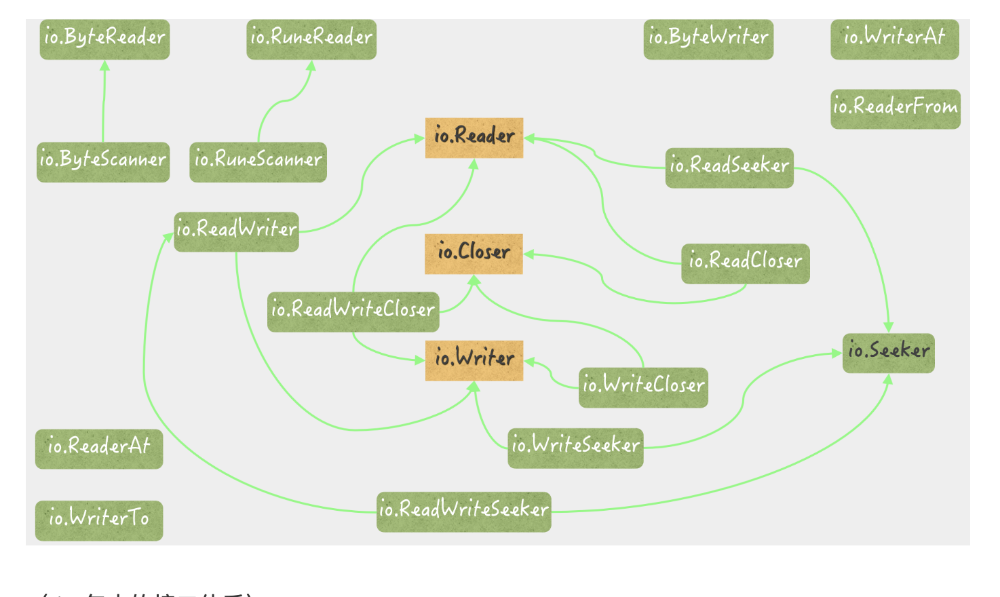

# Golang

> 以下内容来自主要来自极客时间

## 类型转换

1. 字符串和切片值类型转换:

string([]byte{'\xe4', '\xbd', '\xa0', '\xe5', '\xa5', '\xbd'}) // 你好

string([]rune{'\u4F60', '\u597D'}) // 你好

2. 类型别名


Mystring 和 string 是一种类型的俩个别名

Mystring2 和 string 是不同类型

string 是 Mystring2 的潜在类型 他们可以相互转换

但是 []string 和 Mystriing2 不可以进行类型转换

## 并发 sync

### Metux

使用互斥锁要注意:

1. 不要重复锁定互斥锁 可能会导致死锁
2. 不要忘记解锁 使用超时 防止思索哦
3. 不要重复解锁 会报错
4. 不要在函数参数之间传递锁

#### 读写锁

读写互斥
写写互斥

### Cond

提供的方法:

1. wait 等待
2. singal 单发
3. broadcast 广播

demo 俩个人通过一个邮箱通信

```
var mailbox uint8
var lock sync.RWMutex
sendCond := sync.NewCond(&lock)
recvCond := sync.NewCond(lock.RLocker())

```

sendCond 使用写锁初始化
revcCond 使用读锁初始化

发送者

```
lock.Lock()
for mailbox == 1 {
 sendCond.Wait()
}
mailbox = 1
lock.Unlock()
recvCond.Signal()
```

接受者

```
lock.RLock()
for mailbox == 0 {
 recvCond.Wait()
}
mailbox = 0
lock.RUnlock()
sendCond.Signal()

```

Wait 做了什么?

1. 把调用他的 goroutine 放入通知队列
2. 解锁当前的互斥所
3. 让 goroutine 阻塞
4. 等 goroutine 唤醒后解锁

锁定的目的是防止唤醒的时候重复解锁

使用 for 是为了避免意外重复检查

意外情况:

1. 最终解锁后 别的也会唤醒 要检查状态
2. 程序逻辑 多种条件变量检查
3. 多核 cpu 同时唤醒

Cond 发送的通知没有接受者会丢弃

### 原子操作

sync/atomic 提供了几种原子操作?可操作的类型有哪些?

```
add 加法
comopare and swap cas 比较交换
load 加载
store 存
swap 交互
```

类型

```
int32
int64
uint32
uint64
unitptr
unsafe.Point
```

### WaitGroup

典型用法

```
func coordinateWithWaitGroup() {
 var wg sync.WaitGroup
 wg.Add(2)
 num := int32(0)
 fmt.Printf("The number: %d [with sync.WaitGroup]\n", num)
 max := int32(10)
 go addNum(&num, 3, max, wg.Done)
 go addNum(&num, 4, max, wg.Done)
 wg.Wait()
}
```

原则: 一定把 ADD 和 Wait 放一个 groountine

### Once

Do 只能初始化一个 func, 用新的 func 要建立一个新的 func 对象

注意:

1. 使用 once 的函数执行时间尽量短 不然会阻塞别的执行该操作的 groutine
2. 执行函数 panic 也不能重新尝试

### context

```
func coordinateWithContext() {
 total := 12
 var num int32
 fmt.Printf("The number: %d [with context.Context]\n", num)
 cxt, cancelFunc := context.WithCancel(context.Background())
 for i := 1; i <= total; i++ {
  go addNum(&num, i, func() {
   if atomic.LoadInt32(&num) == int32(total) {
    cancelFunc()
   }
  })
 }
 <-cxt.Done()
 fmt.Println("End.")
}
```

### sync.Pool

临时对象池, 多层数据结构:

1. 顶层是本地池列表 列表长度和 P 相等
   

2. 临时对象池
   临时池执行 Put 的时候, 会把临时对象存到 private 里 这个是 P 私有的 (本 P 的 goroutine 访问)
   Get 会先查 private 如果没有回去访问 share (所有 goroutine 共享)

3. private 访问的时候不需要加锁 因为同时只能有一个 访问 share 收到互斥锁的保护

完整流程:


### sync.Map

如何保持 sync.Map 的类型正确

1. 通过函数封装特定类型操作

```
type IntStrMap struct {
 m sync.Map
}

func (iMap *IntStrMap) Delete(key int) {
 iMap.m.Delete(key)
}

func (iMap *IntStrMap) Load(key int) (value string, ok bool) {
 v, ok := iMap.m.Load(key)
 if v != nil {
  value = v.(string)
 }
 return
}

func (iMap *IntStrMap) LoadOrStore(key int, value string) (actual string, loaded bool) {
 a, loaded := iMap.m.LoadOrStore(key, value)
 actual = a.(string)
 return
}

func (iMap *IntStrMap) Range(f func(key int, value string) bool) {
 f1 := func(key, value interface{}) bool {
  return f(key.(int), value.(string))
 }
 iMap.m.Range(f1)
}

func (iMap *IntStrMap) Store(key int, value string) {
 iMap.m.Store(key, value)
}

```

缺点 只能确保特定类型

### 方案 2

```
type ConcurrentMap struct {
 m         sync.Map
 keyType   reflect.Type
 valueType reflect.Type
}

```

读

```
func (cMap *ConcurrentMap) Load(key interface{}) (value interface{}, ok bool) {
 if reflect.TypeOf(key) != cMap.keyType {
  return
 }
 return cMap.m.Load(key)
}

```

写

```
func (cMap *ConcurrentMap) Store(key, value interface{}) {
 if reflect.TypeOf(key) != cMap.keyType {
  panic(fmt.Errorf("wrong key type: %v", reflect.TypeOf(key)))
 }
 if reflect.TypeOf(value) != cMap.valueType {
  panic(fmt.Errorf("wrong value type: %v", reflect.TypeOf(value)))
 }
 cMap.m.Store(key, value)
}

```

### sync.Map 原理

存在一个不用锁访问使用原子操作的快照 read 和一个加锁访问的 dirty, read 不能删除 只能软删除, 会根据 dirty 重建 read.

## Unicode 包

问题 一个 string 值在底层怎么被表示?

一个 string 可以被拆分成 字节序列(rune) 和 字符序列(byte)

因为一个 utf-8 字符可以由[1,4]字节来表示, 所以

```
type rune = int32
```


### 遍历 string

```
str := "Go 爱好者 "
for i, c := range str {
 fmt.Printf("%d: %q [% x]\n", i, c, []byte(string(c)))
}
```

结果

```
0: 'G' [47]
1: 'o' [6f]
2: '爱' [e7 88 b1]
5: '好' [e5 a5 bd]
8: '者' [e8 80 85]
```

所以可知遍历的是 i 是 byte 的位置 c 是 rune 值

## string

### 和 string 相比 Builder 有什么优势?

1. 已存在的内存不变
2. 减少拼接操作带来的内存分配
3. 可将内容重置 重用空间

调用 Grow 方法时 会把原内存内容拷贝后丢弃 放到新的内存空间

使用注意:

1. builder 不能拷贝 拷贝后 Grow 会引发 panic
2. 拷贝 builder 的指针不会引发 panic 但是不是并发安全

### 为什么 string.Reader?

通过保存已读计数 提高效率

```go
offset2 := int64(17)
expectedIndex := reader1.Size() - int64(reader1.Len()) + offset2
fmt.Printf("Seek with offset %d and whence %d ...\n", offset2, io.SeekCurrent)
readingIndex, _ := reader1.Seek(offset2, io.SeekCurrent)
fmt.Printf("The reading index in reader: %d (returned by Seek)\n", readingIndex)
fmt.Printf("The reading index in reader: %d (computed by me)\n", expectedIndex)

```

## bytes

### Buffer

可读可写的缓存

len 是未读部分的长度
cap 返回的已读部分的长度

### Buffer 的已读计数作用?

1. 读内容时, 根据已读部分找到未读部分开始读
2. 写内容需要扩容时, 根据已读计数的情况扩容 (扩容把已读计数之后的部分放在新空间的头部)
3. 截断内容是 根据已读计数截断
4. 重置时 把已读计数置为 0
5. 导出内容 会导出未读部分
6. 获取长度 根据已读计数和内容长度返回未读长度

### Buffer 的扩容策略?

1. 如果内容容器还有空间 直接扩容
2. 不满足的情况下:
   - 覆盖已读部分能否放下?
   - 开新空间

### Buffer 内容泄漏?

Bufferr.Bytes 和 Buffer.Next 可以拿到 Buffer 维护的数组的切片, 修改时会影响到底层的内容, 导致 Buffer 异常

**建议传出前做深拷贝**

## IO

### io 包, io.Reader 的扩展接口和实现类型有哪些? 他们有啥作用?

1. io.ReadWriter: 实现了 io.Reader 和 io.Writer 用于读写
2. io.ReadCloser: io.Reader io.Close 的组合 提供关闭读写通道的功能
3. io.ReadWriteCloser: io.Reader io.Writer 和 io.Close 的组合
4. io.ReadSeeker: 拥有 一个找读写位置的基本方法 seek
5. io.ReadWriteSeeker

实现:

1. io.LimitedReader 此类型包装 io.Reader 的值, 限制 Read 返回的字节数
2. io.SectionReader 会包括 io.ReaderAt 的值 提供任意读取的功能
3. io.teeReader 会 吧 r 的数据通过 p 写入到 w
4. io.multiReader 链接多个 reader 顺序读
5. io.pipe 内存管道
6. io.PipeReader

## io 包接口有哪些? 他们间的关系?

核心接口:

- io.Reader
- io.Writer
- io.Closer

扩展接口:

- io.ByteReader io.RuneReader 读一个字符 和 读一个 unicode 字符
- io.ByteScanner io.RuneScanner 接口 提供前读 和 回退
- io.ReaderAt 无副作用的只读接口
- io.WriteTo 写入到一个 Writer 接口中

  

## bufio

bufio.Reader
bufio.Scanner
bufio.Writer 和 ReaderWriter

bufio.Reader 类型

```
{
    buf:[]byte 字节切片
    rd: io.Reader 底层  读取器
    r: int 代表对缓存区下个读取的位置
    w: int 代表对缓存区下个写入的位置
    err: error
    lastByte: 记录最后一个读取的字节
    lastRuneSize: 最后一个unicode所占用字符数
}
```


