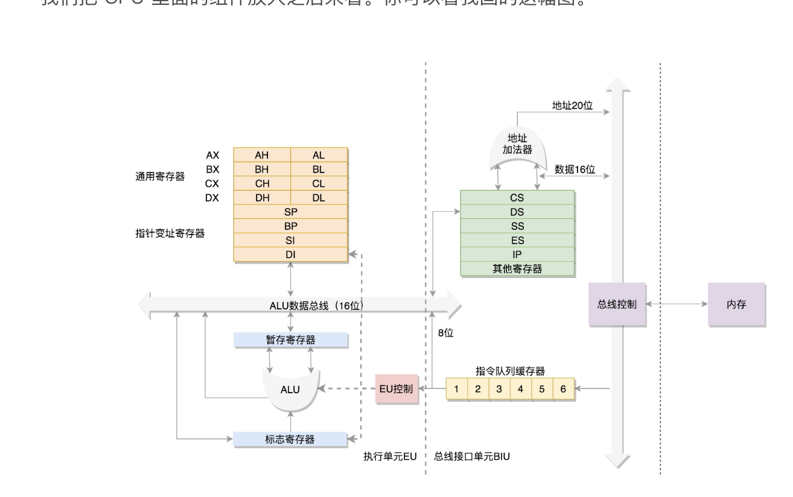
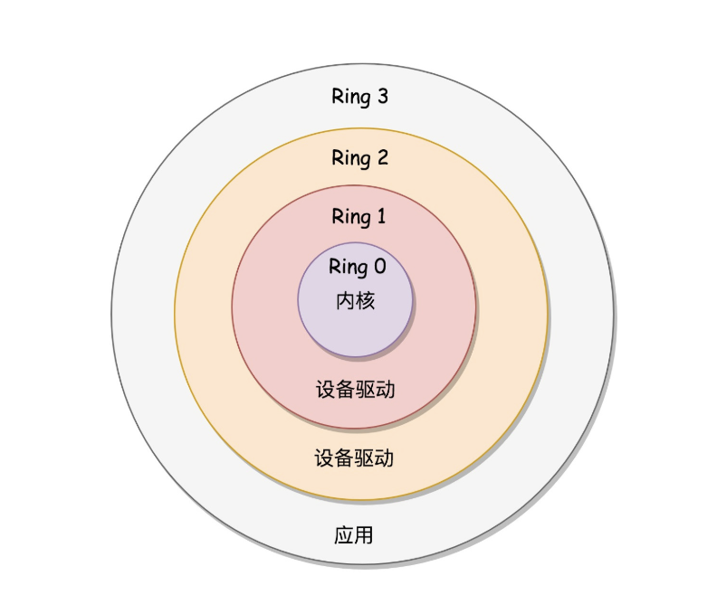
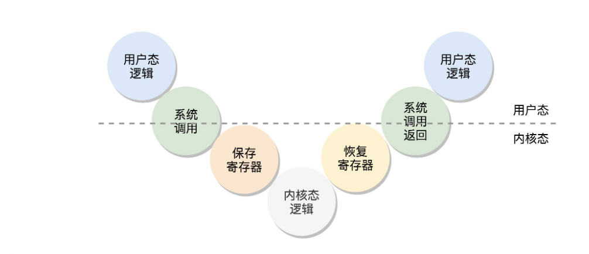
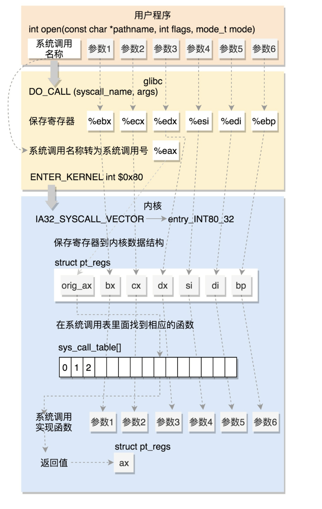
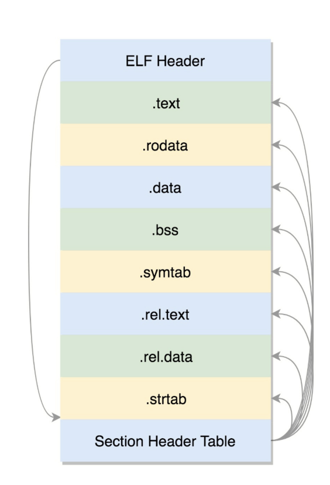
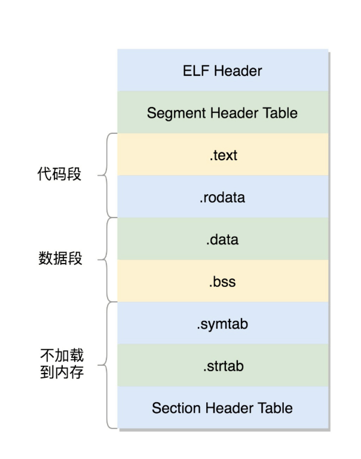
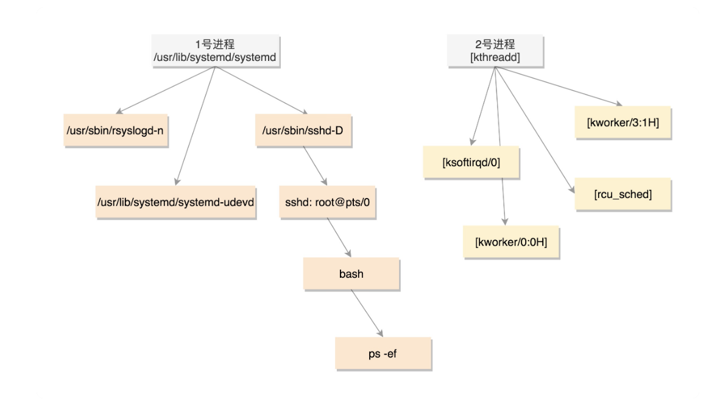
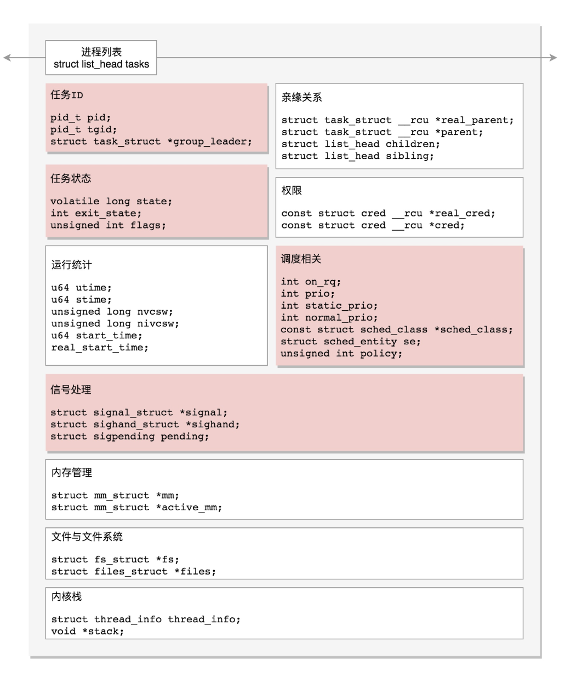
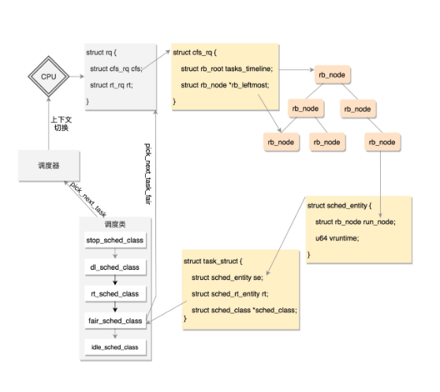
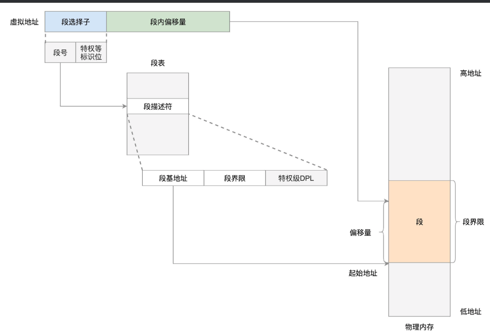

# X86

## 8086 实模式



IP: 下一条指令的寄存器

段寄存器

CS: 代码段寄存器 可以找到代码在内存中的位置
DS: 数据段寄存器 可以找到数据在内存中的位置
SS: 栈寄存器

物理地址 = 段基址<<4 + 段内偏移

## 32 位 保护模式

通过段选择子访问

# 启动流程

1. 加电 重置 CS 和 IP 找到对应 BIOS 程序
2. 映射到 Rom, Bios 做三件事:
   - 检查硬件
   - 提供中断服务, 建 立中断程序和中断表
   - 加载 MBR 执行 grub
3. boot.img 加载 core.img
4. core.img 包括 diskroot.img, lzma_decompress.img, kernel.img 以及其他模块
5. boot.img 先加载运行 diskroot.img, 再由 diskroot.img 加载 core.img 的其他内容
6. diskroot.img 解压运行 lzma_compress.img, 由 lzma_compress.img 切换到保护模式

- 切换到保护模式需要做以下三件事:
  - 启用分段, 辅助进程管理
  - 启动分页, 辅助内存管理
  - 打开其他地址线
- lzma_compress.img 解压运行 grub 内核 kernel.img, kernel.img 做以下四件事:
  - 解析 grub.conf 文件
  - 选择操作系统
  - 例如选择 linux16, 会先读取内核头部数据进行检查, 检查通过后加载完整系统内核
  - 启动系统内核

# 内核初始化

1. 初始化 0 号进程 使用 set_task_tack_end_magic
2. 初始化中断门, 系统调用通过触发中断完成 trap_init
3. 初始化 内存管理(mm_init), 调度模型初始化(sched_init), 文件系统初始化....

区域:



1. ring 0 内核态
2. ring 3 用户态

系统调用流程:



> do\_ 系统调用的内核实现

# 系统调用的封装

请求参数放入寄存器中, 根据系统调用名称 得到系统调用号, 放入 eax

触发软中断 进入内核:

```
# define ENTER_KERNEL int $0x80
```

调用 iret 恢复现场

```
#define INTERRUPT_RETURN                iret

```

流程描述



# 进程

## ELF

- o 格式 ELF



.text 二进制代码
.data 初始化好的全局变量
.rdata 只读数据
.bss 未初始化
.symtable 符号表
.strable 字符串表
.rel.xxx 重定位 不再本.o 的名字 放入这里

- 可执行文件



# .so

> -L 链接自己的 -l 链接系统

.plt 链接过程表
.got 全局 offset 表

工作流程:

> 调用 create_precess

1. PLT[X] 放入定位代码
2. 找到 GOT 里的地址

## linux 进程结构



pid1: 用户的进程
pid2: 内核态的进程

## linux task_structure



### 状态


- TASK_INTERRUPTIBLE 可打断休息
- TASK_UNINTERRUPTIBLE 不可打断 忽略 kill
- TASK_KILLABLE 不可打断 不忽略 kill

## 调度

### 调度方式

```
#define SCHED_NORMAL		0
#define SCHED_FIFO		1
#define SCHED_RR		2
#define SCHED_BATCH		3
#define SCHED_IDLE		5
#define SCHED_DEADLINE		6
```

进程分成实时进程 和 普通进程

实时进程有如下:

- SCHED_FIFO 相同优先级排队 高优先级优先
- SCHED_PR 相同时间片 高优先级优先
- SCHED_DEADLINE 最近 ddl

普通策略:

- SCHED_NORMAL 普通进程
- SCHED_BATCH 后台进程
- SCHED_IDLE 只有空闲的搞

CFS: 公平调度算法

1. 记录进程运行时间 vruntime = vruntime + 实际运行时间 \* NICE / weight

2. 使用红黑树, 找出 vruntime 最小的



# 内存管理

## 分段



1. 请求结构: 

段选择子 + 和段内偏移

2. 段选择子包括: 段号 + 特权等标志

3. 通过段奥


