# Mysql 复习重点

> 以下内容来自极客时间

## 01 架构

组成可分为:

- 客户端
- 服务端：
  - 连接器
  - 分析器 (语法 词法)
  - 优化器 (执行计划)
  - 执行器
- 存储引擎

注意的问题:

- 权限获取发生在连接时
- show processlist 可查看连接状态
- 服务器根据 wait_timeout 断开客户端连接
- 分为长连接和短连接:
- 长连接 过多会导致 oom 原因 临时对象  只在连接断开释放:
  - 定时断开
  - mysql_reset_connection
- 不要使用查询缓存:
  - 更新操作会  失效该表所有查询缓存

## 02 日志

分为 redo log（重做日志）和 bin log(归档日志)

### redo log

类比赊账的黑板 临时缓存
有 write pos(当前可写入游标) 和 checkpoint(记录完毕可以删除)
由 innodb 提供

### 和 bin log 区别

- redo log 是物理日志 记录真实的物理修改 bin log 记录逻辑修改
- redo log 是循环写 bin log 是追加写
- redo log 保证 crash-safe bin log 不保证

### 二段式提交

先写入 redo log (prepare) 再写入 bin log 最后 commit 为了日志内容同步

### 备份恢复

恢复最近的全量 再根据日志恢复

### 参数

- innodb_flush_log_at_trx_commit 每次事务 redo 持久化磁盘 防止异常重庆的数据丢失
- sync_binlog 事务的 bin log 持久化到磁盘

## 事务

### 隔离级别

读未提交, 读提交, 可重复读, 串行化

> 使用 show variables like 'transaction_isolation' 查看隔离级别

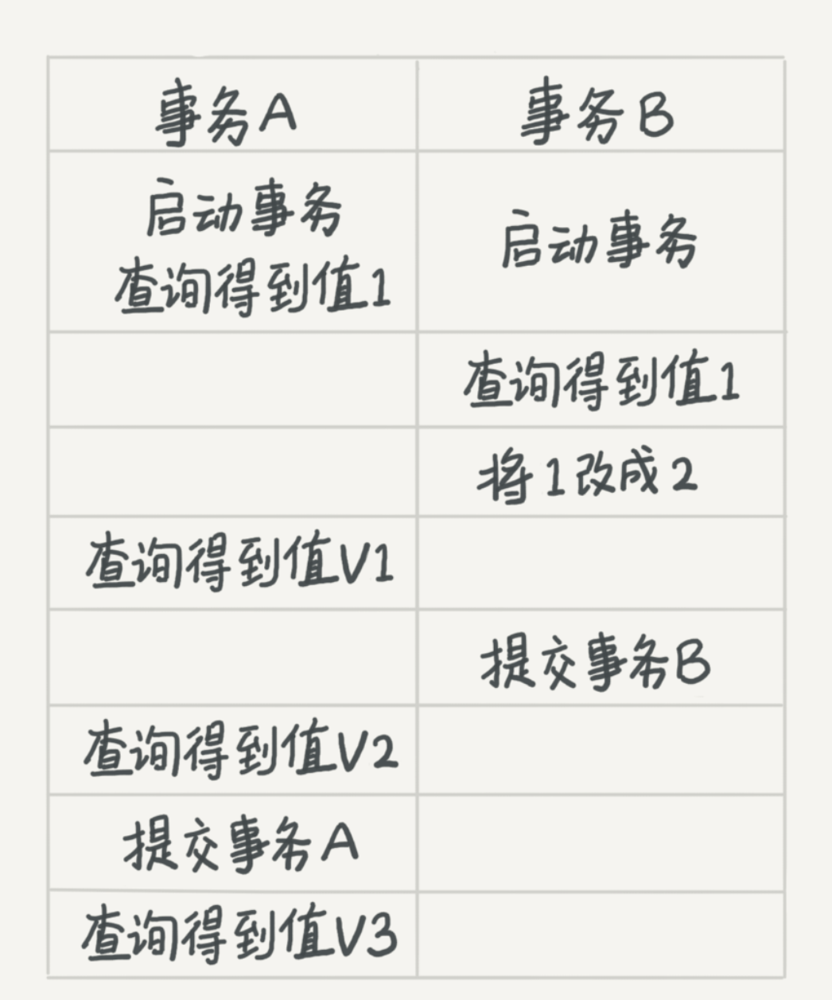

- 读未提交: v1=2, v2=2, v3=2
- 读提交: v1=1, v2=2, v3=2
- 可重复读: v1=1 , v2=1, v3 =2

### 回滚原理

read_viewA -> read_viewB -> read_viewC

回归到 A 必须回滚 C -> B

存储很占资源

### 事务的启动

- 显示 begin commit rollback
- set autocommit = 0

建议使用 autocommit = 1 防止长链接造成 长事务

在 innodb_trx 查询事务

查询大于 60s 的事务

```
select * from information_schema.innodb_trx where TIME_TO_SEC(timediff(now(),trx_started))>60
```

### 避免长事务

1. 使用 autocommit = 1
2. SET MAX_EXECUTEION_TIME 控制最长执行时间
3. 监控 informatino_schema.innodb_trx 表

## 索引

innodb B+ 索引

### 主键索引(聚集索引) 和 普通索引(二级索引)

主键索引只查一次

普通索引先查到主键 再 回表 查主键索引

### 自增

在有序插入的前提下 不引起树的分裂 效率更高

> KV 场景可以不使用自增主键

## 常用索引的优化手段

### 覆盖索引

索引字段 覆盖了 查询索引 不需要回表

### 最左前缀原则

联合索引最左
字符串索引前几个字符

调整顺序维护索引

### 索引下推

5.6 以后版本
(name, age)

```
select * from people where name like '张%' and age = 10 and ismale =1
```

只能用 name 的索引 然后下推到 age 减少回表

> 使用 Alter table T engine=InnoDB 重建索引提高效率

## 锁

大致分为 全局锁, 表级锁, 行锁

### 全局锁

```
FLUSH tables with lock (FTWRL)
```

整个库只处于只读状态 一般用于备份

用 可重复读事务隔离级别 替代

```
mysqldump -single-transaction

```

不使用

```
set gloabal readonly = true

```

1. 可能影响 主从判断
2. 异常处理有问题

### 表锁

```
lock tables rad/write

unlokc tables
```

#### MDL(metadata lock)

对表做增删改时 加 mdl 读锁
对表结构变动时 加 mdl 写锁

读写 和 写之间互斥

給表加字段索引 会扫描全表

> 注意
> 对表结构做变更 可能导致会话拿不到读锁 卡死 客户端超时打爆数据库

解决方法

```
ALTER TABLE xxx WAIT N add colum
ALTER TABLE xxx NOWAIT add colum
```

### 行锁

这个过程中

事务 A 执行完 commit 之前 事务 B 会被阻塞 直到 A commit

> 如果事务中  需要锁多个行 把最可能造成冲突的语句往后放

例子:

影院系统: 1. 顾客 A 账户扣除票价 2. 影院 B 增加票价 3. 记录日志

正确顺序 3 1 2 (影院 B 的记录要多次更新)

### 死锁 和 死锁检测


A 等 B 释放 2 号行锁
B 等 A  释放 1 号行锁

> 解决方案

1. innodb_lock_wait_timeout 设置锁超时 有可能误伤
2. innodb_deadlock_detect on 死锁检测 O(n) 消耗大量 cpu 资源
   无法解决 热点行更新问题

> 热点行更新

1. 中间件 相同行更新排队 控制并发数量
2. 更新行分散 吧账户余额 分散到十行

## 事务隔离

### 快照实现

在 可重复读的隔离级别下 事务启动时会给整个数据库拍一个快照

每个事务开始的时候 会有个 transaction id

每一行数据有多个版本 每个版本有一个 row tx_id

语句更新会生成 undo log

回滚的时候 根据 undo log 计算

#### 快照生成

一个事务启动的时候 记录当前的启动的没提交的事务 trx_ids 最小值作为低水位,
当前系统事务 id 最大值+1 作为高水位


1. 落在绿色部分 说明是已经提交的事务可见
2. 落在红色部分 说明是将来的事务产生 不可见
3. 落在黄色的部分:
   - row tx_id 在 trx_ids 中 是由还未提交的事务产生
   - 不在 trx_ids 中 已经提交的事务 可见

对于一个事务的视图来说:

1. 自己的更新总是可见
2. 版本未提交不可见
3. 版本已提交 但在视图创建后提交 不可见
4. 版本已提交 在视图创建前 可见

更新时使用读当前机制, 加行锁读到最新的数据,更新完成后产生一个自己的版本

在 可重复读的级别下 事务开始创建视图 之后所有查询都用这个视图

在 读提交的级别下 每次执行都创建视图

## 唯一  索引 和 普通索引

innodb 数据页大小 16k 所以查询性能区别微乎其微

### change buffer

更新一个数据的时候 如果数据页在内存中 直接更新, 如果不在内存中 先写入 change buffer, 下次查询访问该数据页时, 讲数据页读入内存. 执行 change buffer 的操作

讲 change buffer 应用到原数据页的操作 称为 merge

以下情况会触发 merge:

1. 访问原数据页
2. 定期 merge
3. 数据库关闭

使用 change buffer 的情况:

1. 唯一索引因为要判断重复 所以必须读数据页 不能使用 change buffer
2. 普通索引可以

change buffer 使用 的是 buffer pool 的内存
通过

```
innodb_change_buffer_max_size
```

设置 change buffer 占用 buffer pool 的百分比

所以 唯一索引会影响**插入和更新**性能

#### 适用场景

change buffer 适用于写多读少的业务. 写入完了被马上访问的概率小(常见 日志 账单)

反过来  写完立刻读 change buffer 会起到副作用

所以 一般情况 尽量使用普通索引, 如果更新完了立刻查 要关闭 change buffer,
如果历史数据之类的东西 尽量开大机械硬盘

### 更新流程分析

```
mysql> insert into t(id,k) values(id1,k1),(id2,k2);

```

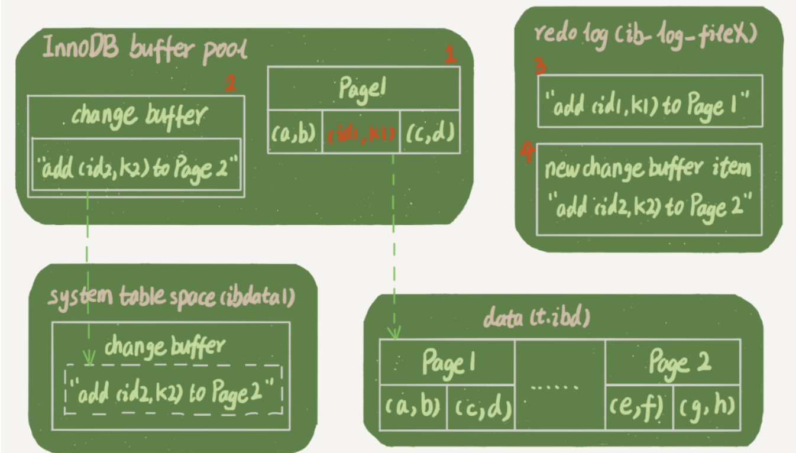

1. 对于 page1(id1)的插入 page1 再 buffer pool 直接插入
2. 对于 page2(id2)的插入 不在内存中 直接写入 change buffer
3. 记录 redo log

完成并且响应 然后后台更新 page1 和 change buffer

redo log 节约了随机写磁盘的消耗  转换成顺序写
change buffer 节约了随机读

注意 change buffer 会记录所有的真实的物理数据页写入  
redo log 会记录所有写入操作 有的写入到 change buffer 有的 写入到物理页,
所以 redo log commit 的时候 和 change buffer 不会冲突

## 选错索引

选择索引是优化器的工作

优化的目的是扫描行数

mysql 执行前不知道真实的扫描, 只能根据统计信息来估算 
这个统计信息称为区分度 一个索引上不同值越多 区分度越大.
一个索引不同值的数量 称为基数 cardinality
通过

```
show index from t
```

查看

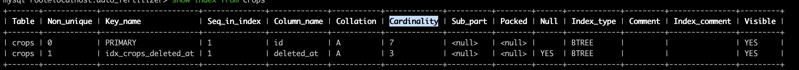

注意 cardinality 不并不准确 通过采样统计 选择 N 个数据页 求平均值,
当更新行数 超过 1/M 会更新统计

通过 mysql _innodb_stats_persistent_ 可以设置 统计信息的存储方式  
on 时 会持久化 off 只在内存中

使用索引 要进行回表 优化器计算的时候 会把回表的代价算进去

使用以下命令 可以重新统计值

```
analyze table t;

```

### 案例分析

```
mysql> select * from t where (a between 1 and 1000)  and (b between 50000 and 100000) order by b limit 1;

```

这个语句应该用 a 索引 但是优化器选择了 b 索引 原因是优化器认为使用 b 可以避免排序

解决方案:

1. forceidnex
2. 修改语句 order by b,a
3. 删除 b 索引

## 字符串索引

1. 前缀索引

```
mysql> select
  count(distinct left(email,4)）as L4,
  count(distinct left(email,5)）as L5,
  count(distinct left(email,6)）as L6,
  count(distinct left(email,7)）as L7,
from SUser;

```

比对个长度前缀区分度

> 前缀索引会造成覆盖索引失效

2.  倒叙存储

用于身份证号 前缀相同 后缀不一样

```
mysql> select field_list from t where id_card = reverse('input_id_card_string');

```

3. hash 字段

```
mysql> select field_list from t where id_card_crc=crc32('input_id_card_string') and id_card='input_id_card_string'

```

## mysql 查询抖动

> 脏页 内存和磁盘数据不一致的页

可能是因为 redo log 刷脏页 (flush)造成的抖动 可能发生在如下情况:

1. redo log 写满
2. 调用新的页内存不足 淘汰的页面如果是脏页 要 flush
3. 系统空闲刷新
4. 关闭时刷新

情况 1 会阻塞住更新 更新会跌倒 0

### 解决方案

1. 正确设置 **innodb_io_capacity** 告诉 mysql 磁盘 io 能力 可通过
   进行测试 如果 ssd 系统 默认值很小

```
 fio -filename=$filename -direct=1 -iodepth 1 -thread -rw=randrw -ioengine=psync -bs=16k -size=500M -numjobs=10 -runtime=10 -group_reporting -name=mytest
```

2. 控制全力刷脏页的速度(innodb_io_capacity \* R%) 这个参数由俩个部分组成:

   1. 脏页比例 可以通过 innodb_max_dirty_pages_pct 脏页比例上限
   1. redo log 写入速度

3. innodb_flush_neighbors 如果  被 flush 页邻居也是脏页 要不要连坐邻居,
   ssd 不建议开启 hd 开启

## 表内存空间

通过设置 innodb_file_per_table 的参数, 可以设置爱数据文件在系统空间还是.idb 文件

如果开启 通过 drop table 可以删除整个文件 释放内存

delete 是软删除 把数据页和记录位置标记为可复用

通过

可以重建表

```
alter table A engine = innodb
```

可以重建 并且 优化统计信息

```
optimize table t
```

## Count(\*) 相关

为了保证多版本并发控制 mysql 不能直接存一个行数

所以 count(\*) 比较慢

count(\*) 和 count(1) 效率最高

可以加个数据数表 记录每一个表的数据数量 通过事务控制一致

## order by 原理

核心机制是 sort_buffer  分配的单位是线程

### 全字段排序

比如执行

```
select city,name,age from t where city='杭州' order by name limit 1000  ;

```

sort_buffer 就是 city, name, age,
先把值放入 sort_buffer 然后对 name 做一次快速排序,
然后直接返回

通过 sort_buffer_size 这个参数 可以对内存中 sort_buffer 做限制 大于这个值会放在硬盘上的临时文件

通过 optimizer_trace 设置 开启本线程的优化

```
/* 打开 optimizer_trace，只对本线程有效 */
SET optimizer_trace='enabled=on';

/* @a 保存 Innodb_rows_read 的初始值 */
select VARIABLE_VALUE into @a from  performance_schema.session_status where variable_name = 'Innodb_rows_read';

/* 执行语句 */
select city, name,age from t where city='杭州' order by name limit 1000;

/* 查看 OPTIMIZER_TRACE 输出 */
SELECT * FROM `information_schema`.`OPTIMIZER_TRACE`\G

/* @b 保存 Innodb_rows_read 的当前值 */
select VARIABLE_VALUE into @b from performance_schema.session_status where variable_name = 'Innodb_rows_read';

/* 计算 Innodb_rows_read 差值 */
select @b-@a;

```

通过 number_of_tmp_files 来查看临时文件使用数量

通过修改该参数设置  排序字段大于该参数值 就更换 row_id 排序算法

```

SET max_length_for_sort_data = 16;

```

### row_id 算法

为了让 sort_buffer 更节省内存.

只把 查完主表 id name 放入 sort_buffer 排序完了通过 id 从原表中取出要的数据返回  
要多查一次主表

### 覆盖索引优化

可以通过覆盖索引 进行优化

## 慢查询  分析

### 字段函数造成的慢查询

#### 使用字段函数

```
mysql> select count(*) from tradelog where month(t_modified)=7;

```

#### 隐式类型转换

> 前提 字符串和数字比较 字符串转成数字

```
mysql> select * from tradelog where tradeid=110717;

```

会转换成

```
mysql> select * from tradelog where  CAST(tradid AS signed int) = 110717;
```

#### 隐式编码转换

> 略

对字段做函数会破坏索引

### 慢查询 锁

通过

```
show processlis
```

查看当前执行状态

#### mdl 锁

#### 等 flush

#### 等行锁

#### 多次修改事务的不提交

查 redo log 花费太多时间

## 幻读

mysql 的解决方案是间隙锁 为了更新进行范围查询的时候 会加上间隙锁 把整个范围的数据加上间隙锁  间隙锁 和 行锁 合在一起 称为 next-key lock

间隙锁 可能会导致死锁

使用参数

```
innodb_locks_unsafe_for_binlog = 1
```

关闭间隙锁

可重复读会开启间隙锁

间隙锁竞争 是往这个*间隙中插入一个记录* 时候发生

## 更新语句锁分析

### 基本加锁原则

1. 加锁的基本单位是 next-row lock 这个是一个左开右闭区间
2. 访问到的对象才会被加锁
3. 等值查询 唯一索引 会退化为行锁
4. 等值查询 右测不满足条件 会退化成间隙锁
5. 唯一索引进行范围查询会查到第一个不满足条件的

### 案列分析

当前表结构 和 数据

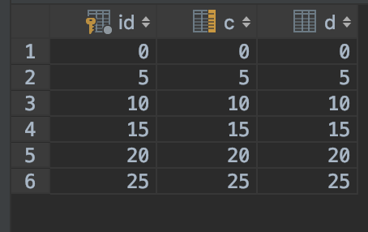

#### 等值查询间隙锁

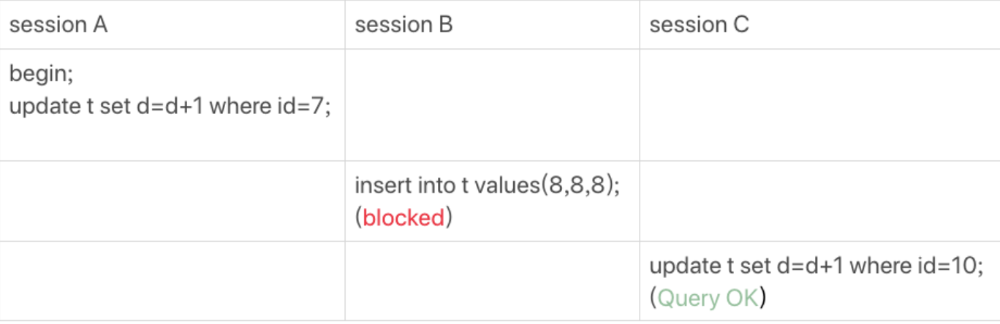

1.  首先是一个 next-row lock 锁住的范围是 (5, 10]
2. 等值查询 ID 10 不满足右侧条件 退化成 gap lock (5, 10)

结果: B 被锁住 C 成功

#### 非唯一索引的索引的等值锁

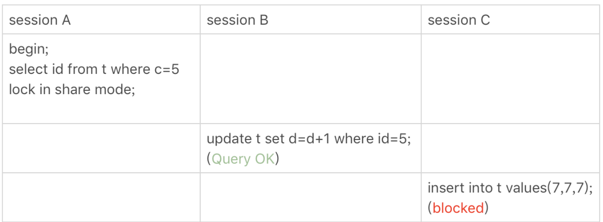

给 c=5 这一行加上读锁

1. 先加 next-row lock 给 (0, 5] 加上 next-row lock
2. c 是普通索引 所以  会访问到 c = 10 所以 (0, 10] 会加上间隙锁
3. 10 不满足 右边 所以退化成 (0,10)
4. 主键所以没锁, 所以 B 正常完成
5. C 因为有锁 被锁住

> 如果使用 for update 主键索引树也会被加锁

#### 主键范围锁

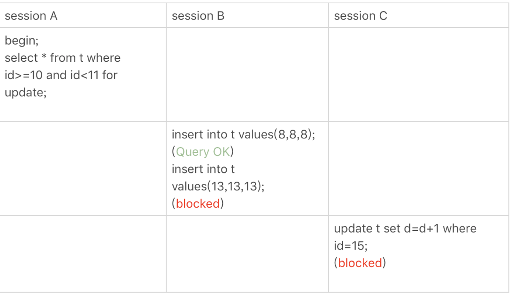

1. 找到一个 id=10 的行, 本该是 next-row key (5,10], 因为 10 存在等值查询 并且 id 是主键 退化成行锁
2. 找到 15 停下来 (5, 15] 唯一索引多找一行

#### 唯一索引 bug


这个场景

1. 会扫到 (10, 15]
2. 会再扫一条不满足的 (15, 20]

#### limit


limit 可以减小加锁的范围

#### 分段加锁

gap lock 和 行锁是分开俩步加的

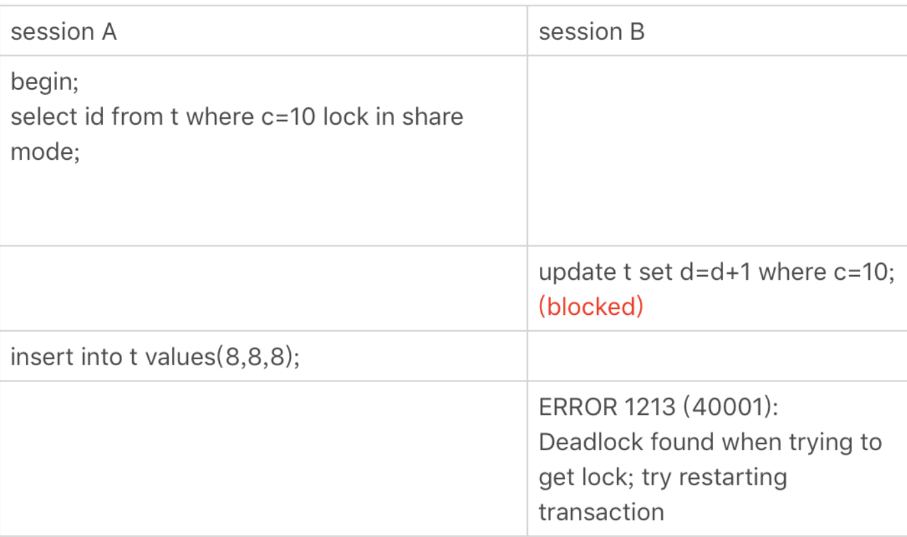

1. 先加上 (5, 10) 间隙锁 和 10 的行锁 和 (10, 15)  间隙

2. B 会取 (5,10) 间隙锁 加锁成功, 加 10 的行锁 失败

3. A 获取 (5,10) 间隙锁失败 形成死锁 B 回滚

## 日志机制

### binlog  写入

bin log 先写入到 bin log cache 事务提交的时候  写入到 bin log 文件中.

每个线程分配一个 bin log cache 通过设置 bin_log_cache_size 用于控制这个 cache 的大小, 超过这个大小就存到磁盘

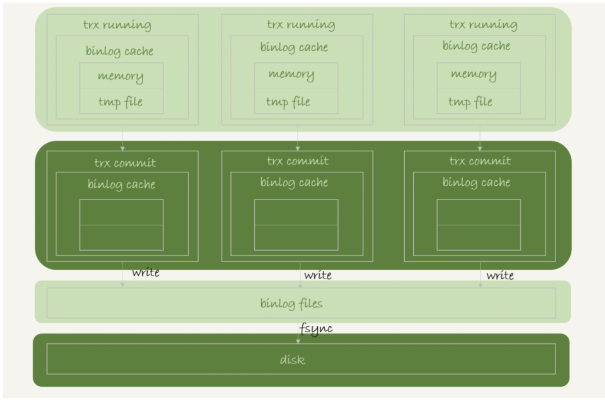

write 是把 bin log 写入 page cache
fsync 把 page cache 写入磁盘

通过设置 sync_binlog 可以 控制写入的行为:

1. sync_binlog=0 提交事务只 write 不 fsync
2. sync_binlog=1 提交事务都 fsync
3. sync_binlog=N 每次都 write n 个事务后 fsync

### redolog 写入

事务执行时 redo log 写入到 redo log buffer 中

redo log 不需要时刻都从 buffer 同步到磁盘 因为事务没提交 丢了也无所谓

通过配置 innodb_flush_log_at_trx_commit 可以控制写入行为:

1. 0 每次提交只写 buffer
2. 1 提交  时候 持久到  硬盘
3. 2 只写入到 page cache

redo log 可能会在没提交的时候写入到磁盘

1. 后台 1s 的定时刷新
2.  达到 innodb_log_buffer_size 一半的时候
3. 并  行的 trx 提交 顺带写入

### 组提交

第一个到达写入队列的 trx 在写入时 会把一起到  了的 trx 一起写入

为了  利用组提交带来的性能优化,  事务的完整提交流程如下

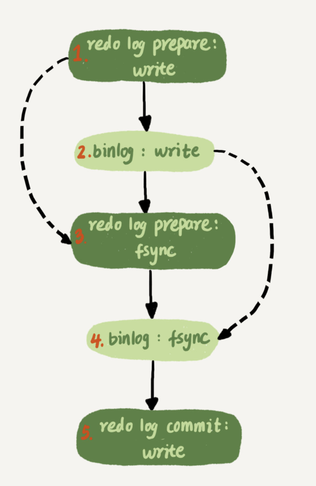

设置参数 binlog_group_commit_sync_delay(延迟多少秒) 和 binlog_group_commit_sync_no_delay_count (延迟多少个) 关系 逻辑或

## 主备一致

完成流程

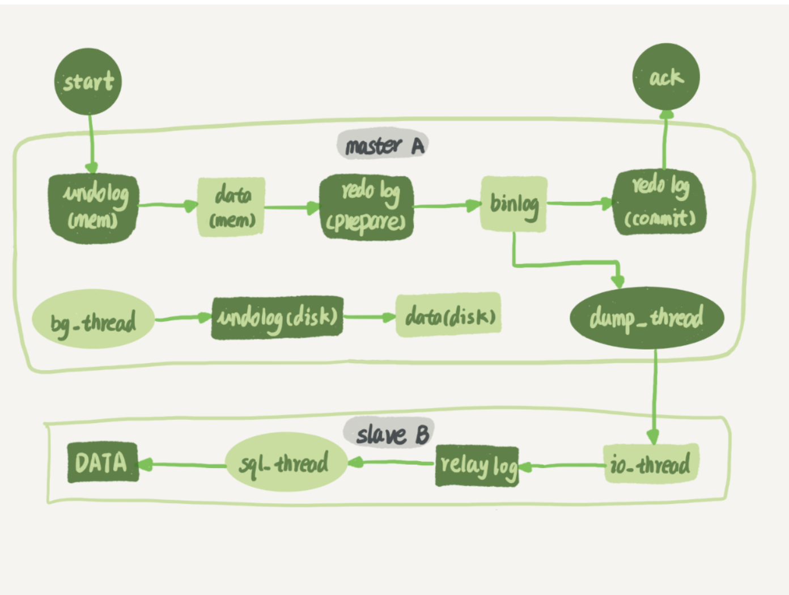

 使用 bin log 完成主备一致, bin log 有三种格式: row, statement, mixed,

row:  推荐格式,  记录物理改变, 占内存, 略慢
statement: 记录执行语句 有一致性的问题, 省内存(比如 limit 有可能走不同的索引树)
mixed: 大部分都 statement 容易不一致的场景使用 row

## 高可用

### 主备延迟

在备库执行

```
show slave status

```

可以通过 seconds_behind_master 查看主备延迟

该参数通过 bin log 的时间戳和当前备库时间戳差得到

延迟有俩个阶段:

1. 主库完成消费到发送给备库 备库接受完成
2. 备库执行完成 (主要)

延迟的原因:

1. 主库备库机器性能不对称
2. 备库查询压力太大
3. 大事务:
   1. 一次删除过多
   2. 大表 ddl

###  主备切换

#### 可靠性优先

步骤:

1.  判断备库 sbm 小于一个阈值
2. 主库设置成只读状态
3. 等到备库 sbm 为 0
4. 关闭备库 read only  切换业务 完成

存在不可用时间, 所以要等 sbm 足够小才能切换

#### 可用性优先

直接切换  会造成数据不一致

## 备库并行复制策略

1. mysql 5.5 之前无并行复制
2. 按表分发
3. 按行分发(要求 1.bin log row 2.必须有主键 3.不能有外键)

## 一主多从 

### 主备  切换

#### 基于位点

从库执行 change master 命令

```
CHANGE MASTER TO
MASTER_HOST=$host_name
MASTER_PORT=$port
MASTER_USER=$user_name
MASTER_PASSWORD=$password
MASTER_LOG_FILE=$master_log_name
MASTER_LOG_POS=$master_log_pos
```

从 MASTER_LOG_FILE 的  日志文件 的 MASTER_LOG_POS 位置 进行同步

取同步位点方法:

> 一般没办法取到准确的位点 会稍微往前取一点

1. 等待  新主库 完成日志中转完成
2. 使用 show master status 获取 新主库 的 日志 File 和 最新的 position
3. 取 原主库 的故障时刻 t
4. 使用 bin log 解析工具 获取  位点(end_log_pos)

```
mysqlbinlog File --stop-datetime=T --start-datetime=T
```

错误处理:

1. 跳过所有出错的事务

```
set global sql_slave_skip_counter=1;
start slave;
```

2. 跳过指定错误
   设置
   slave_skip_errors 为 "1032,1062" 跳过唯一建错误 和 删除
   找不到行

#### GTID

对一个事务标记一个  集群唯一的 id:

事务提交的时候生成一个

```
GTID=server_uuid:gno

```
