# Mysql 复习重点

> 以下内容来自极客时间

## 01 架构

组成可分为:

- 客户端
- 服务端：
  - 连接器
  - 分析器 (语法 词法)
  - 优化器 (执行计划)
  - 执行器
- 存储引擎

注意的问题:

- 权限获取发生在连接时
- show processlist 可查看连接状态
- 服务器根据 wait_timeout 断开客户端连接
- 分为长连接和短连接:
- 长连接 过多会导致 oom 原因 临时对象  只在连接断开释放:
  - 定时断开
  - mysql_reset_connection
- 不要使用查询缓存:
  - 更新操作会  失效该表所有查询缓存

## 02 日志

分为 redo log（重做日志）和 bin log(归档日志)

### redo log

类比赊账的黑板 临时缓存
有 write pos(当前可写入游标) 和 checkpoint(记录完毕可以删除)
由 innodb 提供

### 和 bin log 区别

- redo log 是物理日志 记录真实的物理修改 bin log 记录逻辑修改
- redo log 是循环写 bin log 是追加写
- redo log 保证 crash-safe bin log 不保证

### 二段式提交

先写入 redo log (prepare) 再写入 bin log 最后 commit 为了日志内容同步

### 备份恢复

恢复最近的全量 再根据日志恢复

### 参数

- innodb_flush_log_at_trx_commit 每次事务 redo 持久化磁盘 防止异常重庆的数据丢失
- sync_binlog 事务的 bin log 持久化到磁盘

## 事务

### 隔离级别

读未提交, 读提交, 可重复读, 串行化

> 使用 show variables like 'transaction_isolation' 查看隔离级别


- 读未提交: v1=2, v2=2, v3=2
- 读提交: v1=1, v2=2, v3=2
- 可重复读: v1=1 , v2=1, v3 =2

### 回滚原理

read_viewA -> read_viewB -> read_viewC

回归到 A 必须回滚 C -> B

存储很占资源

### 事务的启动

- 显示 begin commit rollback
- set autocommit = 0

建议使用 autocommit = 1 防止长链接造成 长事务

在 innodb_trx 查询事务

查询大于 60s 的事务

```
select * from information_schema.innodb_trx where TIME_TO_SEC(timediff(now(),trx_started))>60
```

### 避免长事务

1. 使用 autocommit = 1
2. SET MAX_EXECUTEION_TIME 控制最长执行时间
3. 监控 informatino_schema.innodb_trx 表

## 索引

innodb B+ 索引

### 主键索引(聚集索引) 和 普通索引(二级索引)

主键索引只查一次

普通索引先查到主键 再 回表 查主键索引

### 自增

在有序插入的前提下 不引起树的分裂 效率更高

> KV 场景可以不使用自增主键

## 常用索引的优化手段

### 覆盖索引

索引字段 覆盖了 查询索引 不需要回表

### 最左前缀原则

联合索引最左
字符串索引前几个字符

调整顺序维护索引

### 索引下推

5.6 以后版本
(name, age)

```
select * from people where name like '张%' and age = 10 and ismale =1
```

只能用 name 的索引 然后下推到 age 减少回表

> 使用 Alter table T engine=InnoDB 重建索引提高效率

## 锁

大致分为 全局锁, 表级锁, 行锁

### 全局锁

```
FLUSH tables with lock (FTWRL)
```

整个库只处于只读状态 一般用于备份

用 可重复读事务隔离级别 替代

```
mysqldump -single-transaction

```

不使用

```
set gloabal readonly = true

```

1. 可能影响 主从判断
2. 异常处理有问题

### 表锁

```
lock tables rad/write

unlokc tables
```

#### MDL(metadata lock)

对表做增删改时 加 mdl 读锁
对表结构变动时 加 mdl 写锁

读写 和 写之间互斥

給表加字段索引 会扫描全表

> 注意
> 对表结构做变更 可能导致会话拿不到读锁 卡死 客户端超时打爆数据库

解决方法

```
ALTER TABLE xxx WAIT N add colum
ALTER TABLE xxx NOWAIT add colum
```

### 行锁

这个过程中

事务 A 执行完 commit 之前 事务 B 会被阻塞 直到 A commit

> 如果事务中  需要锁多个行 把最可能造成冲突的语句往后放

例子:

影院系统: 1. 顾客 A 账户扣除票价 2. 影院 B 增加票价 3. 记录日志

正确顺序 3 1 2 (影院 B 的记录要多次更新)

### 死锁 和 死锁检测


A 等 B 释放 2 号行锁
B 等 A  释放 1 号行锁

> 解决方案

1. innodb_lock_wait_timeout 设置锁超时 有可能误伤
2. innodb_deadlock_detect on 死锁检测 O(n) 消耗大量 cpu 资源
   无法解决 热点行更新问题

> 热点行更新

1. 中间件 相同行更新排队 控制并发数量
2. 更新行分散 吧账户余额 分散到十行

## 事务隔离

### 快照实现

在 可重复读的隔离级别下 事务启动时会给整个数据库拍一个快照

每个事务开始的时候 会有个 transaction id

每一行数据有多个版本 每个版本有一个 row tx_id

语句更新会生成 undo log

回滚的时候 根据 undo log 计算

#### 快照生成

一个事务启动的时候 记录当前的启动的没提交的事务 trx_ids 最小值作为低水位,
当前系统事务 id 最大值+1 作为高水位


1. 落在绿色部分 说明是已经提交的事务可见
2. 落在红色部分 说明是将来的事务产生 不可见
3. 落在黄色的部分:
   - row tx_id 在 trx_ids 中 是由还未提交的事务产生
   - 不在 trx_ids 中 已经提交的事务 可见

对于一个事务的视图来说:

1. 自己的更新总是可见
2. 版本未提交不可见
3. 版本已提交 但在视图创建后提交 不可见
4. 版本已提交 在视图创建前 可见

更新时使用读当前机制, 加行锁读到最新的数据,更新完成后产生一个自己的版本

在 可重复读的级别下 事务开始创建视图 之后所有查询都用这个视图

在 读提交的级别下 每次执行都创建视图

## 唯一  索引 和 普通索引

innodb 数据页大小 16k 所以查询性能区别微乎其微

### change buffer

更新一个数据的时候 如果数据页在内存中 直接更新, 如果不在内存中 先写入 change buffer, 下次查询访问该数据页时, 讲数据页读入内存. 执行 change buffer 的操作

讲 change buffer 应用到原数据页的操作 称为 merge

以下情况会触发 merge:

1. 访问原数据页
2. 定期 merge
3. 数据库关闭

使用 change buffer 的情况:

1. 唯一索引因为要判断重复 所以必须读数据页 不能使用 change buffer
2. 普通索引可以

change buffer 使用 的是 buffer pool 的内存
通过

```
innodb_change_buffer_max_size
```

设置 change buffer 占用 buffer pool 的百分比

所以 唯一索引会影响**插入和更新**性能

#### 适用场景

change buffer 适用于写多读少的业务. 写入完了被马上访问的概率小(常见 日志 账单)

反过来  写完立刻读 change buffer 会起到副作用

所以 一般情况 尽量使用普通索引, 如果更新完了立刻查 要关闭 change buffer,
如果历史数据之类的东西 尽量开大机械硬盘

### 更新流程分析

```
mysql> insert into t(id,k) values(id1,k1),(id2,k2);

```


1. 对于 page1(id1)的插入 page1 再 buffer pool 直接插入
2. 对于 page2(id2)的插入 不在内存中 直接写入 change buffer
3. 记录 redo log

完成并且响应 然后后台更新 page1 和 change buffer

redo log 节约了随机写磁盘的消耗  转换成顺序写
change buffer 节约了随机读

注意 change buffer 会记录所有的真实的物理数据页写入  
redo log 会记录所有写入操作 有的写入到 change buffer 有的 写入到物理页,
所以 redo log commit 的时候 和 change buffer 不会冲突

## 选错索引

选择索引是优化器的工作

优化的目的是扫描行数

mysql 执行前不知道真实的扫描, 只能根据统计信息来估算 
这个统计信息称为区分度 一个索引上不同值越多 区分度越大.
一个索引不同值的数量 称为基数 cardinality
通过

```
show index from t
```

查看

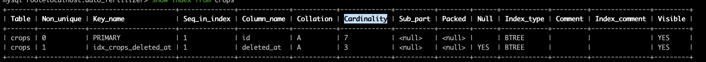

注意 cardinality 不并不准确 通过采样统计 选择 N 个数据页 求平均值,
当更新行数 超过 1/M 会更新统计

通过 mysql _innodb_stats_persistent_ 可以设置 统计信息的存储方式  
on 时 会持久化 off 只在内存中

使用索引 要进行回表 优化器计算的时候 会把回表的代价算进去

使用以下命令 可以重新统计值

```
analyze table t;

```

### 案例分析

```
mysql> select * from t where (a between 1 and 1000)  and (b between 50000 and 100000) order by b limit 1;

```

这个语句应该用 a 索引 但是优化器选择了 b 索引 原因是优化器认为使用 b 可以避免排序

解决方案:

1. forceidnex
2. 修改语句 order by b,a
3. 删除 b 索引

## 字符串索引

1. 前缀索引

```
mysql> select
  count(distinct left(email,4)）as L4,
  count(distinct left(email,5)）as L5,
  count(distinct left(email,6)）as L6,
  count(distinct left(email,7)）as L7,
from SUser;

```

比对个长度前缀区分度

> 前缀索引会造成覆盖索引失效

2.  倒叙存储

用于身份证号 前缀相同 后缀不一样

```
mysql> select field_list from t where id_card = reverse('input_id_card_string');

```

3. hash 字段

```
mysql> select field_list from t where id_card_crc=crc32('input_id_card_string') and id_card='input_id_card_string'

```

## mysql 查询抖动

> 脏页 内存和磁盘数据不一致的页

可能是因为 redo log 刷脏页 (flush)造成的抖动 可能发生在如下情况:

1. redo log 写满
2. 调用新的页内存不足 淘汰的页面如果是脏页 要 flush
3. 系统空闲刷新
4. 关闭时刷新

情况 1 会阻塞住更新 更新会跌倒 0

### 解决方案

1. 正确设置 **innodb_io_capacity** 告诉 mysql 磁盘 io 能力 可通过
   进行测试 如果 ssd 系统 默认值很小

```
 fio -filename=$filename -direct=1 -iodepth 1 -thread -rw=randrw -ioengine=psync -bs=16k -size=500M -numjobs=10 -runtime=10 -group_reporting -name=mytest
```

2. 控制全力刷脏页的速度(innodb_io_capacity \* R%) 这个参数由俩个部分组成:

   1. 脏页比例 可以通过 innodb_max_dirty_pages_pct 脏页比例上限
   1. redo log 写入速度

3. innodb_flush_neighbors 如果  被 flush 页邻居也是脏页 要不要连坐邻居,
   ssd 不建议开启 hd 开启

## 表内存空间

通过设置 innodb_file_per_table 的参数, 可以设置爱数据文件在系统空间还是.idb 文件

如果开启 通过 drop table 可以删除整个文件 释放内存

delete 是软删除 把数据页和记录位置标记为可复用

通过

可以重建表

```
alter table A engine = innodb
```

可以重建 并且 优化统计信息

```
optimize table t
```

## Count(\*) 相关

为了保证多版本并发控制 mysql 不能直接存一个行数

所以 count(\*) 比较慢

count(\*) 和 count(1) 效率最高

可以加个数据数表 记录每一个表的数据数量 通过事务控制一致

## order by 原理

核心机制是 sort_buffer  分配的单位是线程

### 全字段排序

比如执行

```
select city,name,age from t where city='杭州' order by name limit 1000  ;

```

sort_buffer 就是 city, name, age,
先把值放入 sort_buffer 然后对 name 做一次快速排序,
然后直接返回

通过 sort_buffer_size 这个参数 可以对内存中 sort_buffer 做限制 大于这个值会放在硬盘上的临时文件

通过 optimizer_trace 设置 开启本线程的优化

```
/* 打开 optimizer_trace，只对本线程有效 */
SET optimizer_trace='enabled=on';

/* @a 保存 Innodb_rows_read 的初始值 */
select VARIABLE_VALUE into @a from  performance_schema.session_status where variable_name = 'Innodb_rows_read';

/* 执行语句 */
select city, name,age from t where city='杭州' order by name limit 1000;

/* 查看 OPTIMIZER_TRACE 输出 */
SELECT * FROM `information_schema`.`OPTIMIZER_TRACE`\G

/* @b 保存 Innodb_rows_read 的当前值 */
select VARIABLE_VALUE into @b from performance_schema.session_status where variable_name = 'Innodb_rows_read';

/* 计算 Innodb_rows_read 差值 */
select @b-@a;

```

通过 number_of_tmp_files 来查看临时文件使用数量

通过修改该参数设置  排序字段大于该参数值 就更换 row_id 排序算法

```

SET max_length_for_sort_data = 16;

```

### row_id 算法

为了让 sort_buffer 更节省内存.

只把 查完主表 id name 放入 sort_buffer 排序完了通过 id 从原表中取出要的数据返回  
要多查一次主表

### 覆盖索引优化

可以通过覆盖索引 进行优化

## 慢查询  分析

### 字段函数造成的慢查询

#### 使用字段函数

```
mysql> select count(*) from tradelog where month(t_modified)=7;

```

#### 隐式类型转换

> 前提 字符串和数字比较 字符串转成数字

```
mysql> select * from tradelog where tradeid=110717;

```

会转换成

```
mysql> select * from tradelog where  CAST(tradid AS signed int) = 110717;
```

#### 隐式编码转换

> 略

对字段做函数会破坏索引

### 慢查询 锁

通过

```
show processlis
```

查看当前执行状态

#### mdl 锁

#### 等 flush

#### 等行锁

#### 多次修改事务的不提交

查 redo log 花费太多时间

## 幻读

mysql 的解决方案是间隙锁 为了更新进行范围查询的时候 会加上间隙锁 把整个范围的数据加上间隙锁  间隙锁 和 行锁 合在一起 称为 next-key lock

间隙锁 可能会导致死锁

使用参数

```
innodb_locks_unsafe_for_binlog = 1
```

关闭间隙锁

可重复读会开启间隙锁

间隙锁竞争 是往这个*间隙中插入一个记录* 时候发生

## 更新语句锁分析

### 基本加锁原则

1. 加锁的基本单位是 next-row lock 这个是一个左开右闭区间
2. 访问到的对象才会被加锁
3. 等值查询 唯一索引 会退化为行锁
4. 等值查询 右测不满足条件 会退化成间隙锁
5. 唯一索引进行范围查询会查到第一个不满足条件的

### 案列分析

当前表结构 和 数据

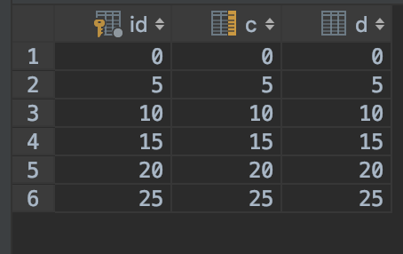

#### 等值查询间隙锁

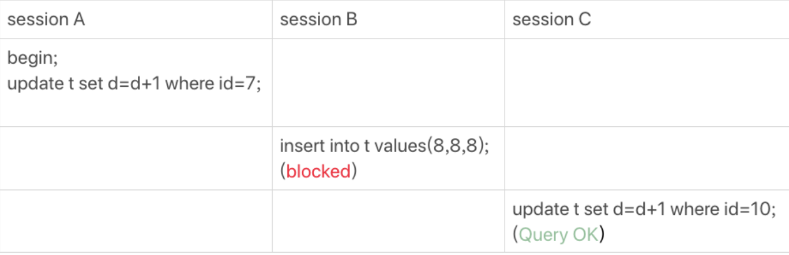

1.  首先是一个 next-row lock 锁住的范围是 (5, 10]
2. 等值查询 ID 10 不满足右侧条件 退化成 gap lock (5, 10)

结果: B 被锁住 C 成功

#### 非唯一索引的索引的等值锁

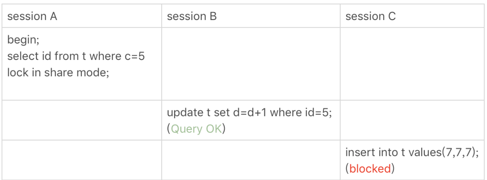

给 c=5 这一行加上读锁

1. 先加 next-row lock 给 (0, 5] 加上 next-row lock
2. c 是普通索引 所以  会访问到 c = 10 所以 (0, 10] 会加上间隙锁
3. 10 不满足 右边 所以退化成 (0,10)
4. 主键所以没锁, 所以 B 正常完成
5. C 因为有锁 被锁住

> 如果使用 for update 主键索引树也会被加锁

#### 主键范围锁

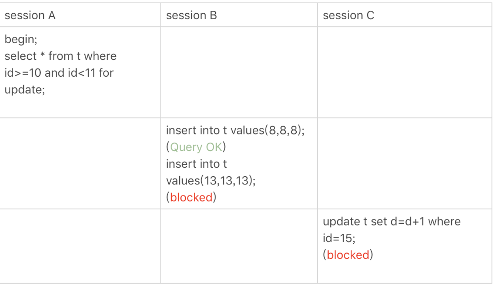

1. 找到一个 id=10 的行, 本该是 next-row key (5,10], 因为 10 存在等值查询 并且 id 是主键 退化成行锁
2. 找到 15 停下来 (5, 15] 唯一索引多找一行

#### 唯一索引 bug

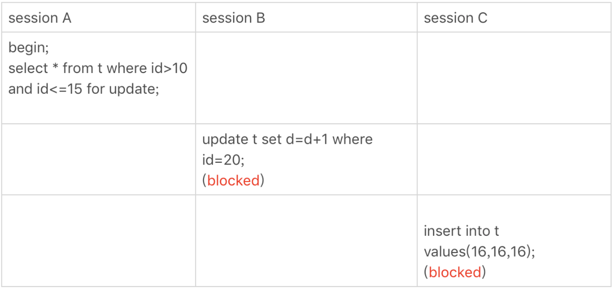

这个场景

1. 会扫到 (10, 15]
2. 会再扫一条不满足的 (15, 20]

#### limit


limit 可以减小加锁的范围

#### 分段加锁

gap lock 和 行锁是分开俩步加的

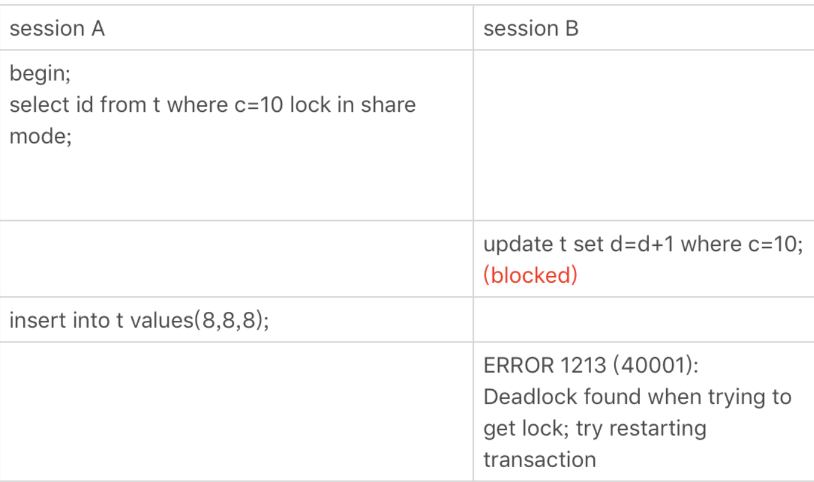

1. 先加上 (5, 10) 间隙锁 和 10 的行锁 和 (10, 15)  间隙

2. B 会取 (5,10) 间隙锁 加锁成功, 加 10 的行锁 失败

3. A 获取 (5,10) 间隙锁失败 形成死锁 B 回滚

## 日志机制

### binlog  写入

bin log 先写入到 bin log cache 事务提交的时候  写入到 bin log 文件中.

每个线程分配一个 bin log cache 通过设置 bin_log_cache_size 用于控制这个 cache 的大小, 超过这个大小就存到磁盘

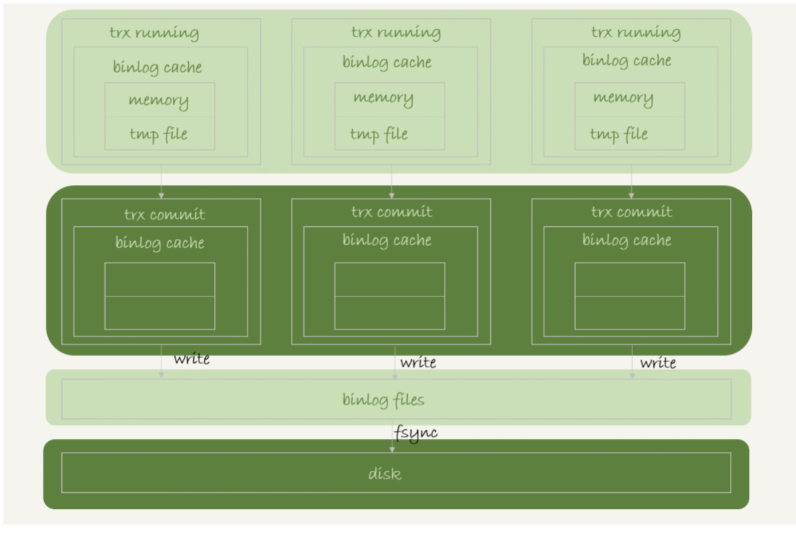

write 是把 bin log 写入 page cache
fsync 把 page cache 写入磁盘

通过设置 sync_binlog 可以 控制写入的行为:

1. sync_binlog=0 提交事务只 write 不 fsync
2. sync_binlog=1 提交事务都 fsync
3. sync_binlog=N 每次都 write n 个事务后 fsync

### redolog 写入

事务执行时 redo log 写入到 redo log buffer 中

redo log 不需要时刻都从 buffer 同步到磁盘 因为事务没提交 丢了也无所谓

通过配置 innodb_flush_log_at_trx_commit 可以控制写入行为:

1. 0 每次提交只写 buffer
2. 1 提交  时候 持久到  硬盘
3. 2 只写入到 page cache

redo log 可能会在没提交的时候写入到磁盘

1. 后台 1s 的定时刷新
2.  达到 innodb_log_buffer_size 一半的时候
3. 并  行的 trx 提交 顺带写入

### 组提交

第一个到达写入队列的 trx 在写入时 会把一起到  了的 trx 一起写入

为了  利用组提交带来的性能优化,  事务的完整提交流程如下

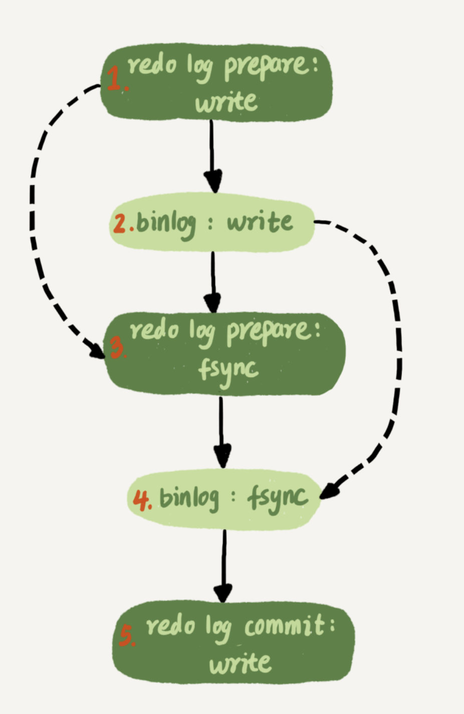

设置参数 binlog_group_commit_sync_delay(延迟多少秒) 和 binlog_group_commit_sync_no_delay_count (延迟多少个) 关系 逻辑或

## 主备一致

完成流程

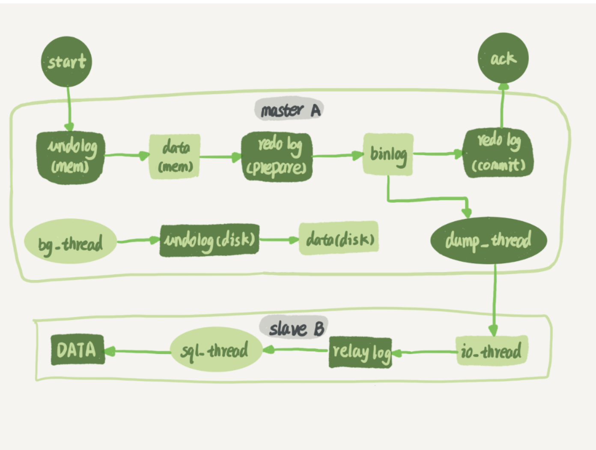

 使用 bin log 完成主备一致, bin log 有三种格式: row, statement, mixed,

row:  推荐格式,  记录物理改变, 占内存, 略慢
statement: 记录执行语句 有一致性的问题, 省内存(比如 limit 有可能走不同的索引树)
mixed: 大部分都 statement 容易不一致的场景使用 row

## 高可用

### 主备延迟

在备库执行

```
show slave status

```

可以通过 seconds_behind_master 查看主备延迟

该参数通过 bin log 的时间戳和当前备库时间戳差得到

延迟有俩个阶段:

1. 主库完成消费到发送给备库 备库接受完成
2. 备库执行完成 (主要)

延迟的原因:

1. 主库备库机器性能不对称
2. 备库查询压力太大
3. 大事务:
   1. 一次删除过多
   2. 大表 ddl

###  主备切换

#### 可靠性优先

步骤:

1.  判断备库 sbm 小于一个阈值
2. 主库设置成只读状态
3. 等到备库 sbm 为 0
4. 关闭备库 read only  切换业务 完成

存在不可用时间, 所以要等 sbm 足够小才能切换

#### 可用性优先

直接切换  会造成数据不一致

## 备库并行复制策略

1. mysql 5.5 之前无并行复制
2. 按表分发
3. 按行分发(要求 1.bin log row 2.必须有主键 3.不能有外键)

## 一主多从 

### 主备  切换

#### 基于位点

从库执行 change master 命令

```
CHANGE MASTER TO
MASTER_HOST=$host_name
MASTER_PORT=$port
MASTER_USER=$user_name
MASTER_PASSWORD=$password
MASTER_LOG_FILE=$master_log_name
MASTER_LOG_POS=$master_log_pos
```

从 MASTER_LOG_FILE 的  日志文件 的 MASTER_LOG_POS 位置 进行同步

取同步位点方法:

> 一般没办法取到准确的位点 会稍微往前取一点

1. 等待  新主库 完成日志中转完成
2. 使用 show master status 获取 新主库 的 日志 File 和 最新的 position
3. 取 原主库 的故障时刻 t
4. 使用 bin log 解析工具 获取  位点(end_log_pos)

```
mysqlbinlog File --stop-datetime=T --start-datetime=T
```

错误处理:

1. 跳过所有出错的事务

```
set global sql_slave_skip_counter=1;
start slave;
```

2. 跳过指定错误
   设置
   slave_skip_errors 为 "1032,1062" 跳过唯一建错误 和 删除
   找不到行

#### GTID

对一个事务标记一个  集群唯一的 id:

事务提交的时候生成一个

```
GTID=server_uuid:gno

```

## 读写分离

### 架构

1. 客户端直接连接(zookeeper)
2. proxy 代理

### 过期读避免

1. 强制走主库方案

对查询进行分类 把不能过期读的查询分到主库上

2. sleep 方案 比如 ajax 场景先做一个前端的假的新增

3. 判断主备延迟方案

   1. seconds_behind_master 为 0
   2.  位点同步法 master_log_file 和 read_mater_log_pos 为主库的位点
      relay_log_file 和 exec_log_log_pos 表示备库执
   3. 对比 GTID 集合

4. semi-sync 半同步复制

   步骤:

   1. 主库执行完事务后 吧 bin log 发给  从库
   2. 从库收到后  给主库 ack
   3. 主库收到 ack 后认为完成

   存在问题:

   1.  一主多从存在过期读
   2. 持续延迟会过度等待????

5. 等主库位点

   通过,

   ```
   select master_pos_wait(file, pos[, timeout]);
   ```

   在从库执行, file 查询的主库文件 pos 查询的主库位置 timeout 超时时间
   返回到 该命令执行 到 file pos 位置 执行了多少事务

   使用逻辑

   1. 事务执行完成后 执行 show master status 获取 file pos
   2. 选定一个从库查询
   3. select master_pos_wait(file, pos,1)
   4. 返回 >=0 在该从库执行 否则 主库执行

6. GTID

   ```
   select wait_for_executed_gtid_set(gtid_set, 1);
   ```

   等待 这个库执行的事务包含 gtid_set 返回 0, 超时返回 1

   流程:

   1. trx 执行完了  获取 GTID 记为 gtid1
   2.  选定一个从库执行 select wait_for_executed_gtid_set(gtid1, 1);
   3. 如果 0 执行查询 否则 回主库

## 数据库异常监测

### select 1

bad case:
比如  并发数量 达到了 innodb_thread_concurrency 设置的值, 此时  正常的查询  无法执行

### 查表判断

在系统库(mysql)中放一个只有一条数据的表

存在问题:
bin log 磁盘满了
更新和事务提交 commit 无法生效 但是查询正常

### 更新判断

```
mysql> CREATE TABLE `health_check` (
`id` int(11) NOT NULL,
`t_modified` timestamp NOT NULL DEFAULT CURRENT_TIMESTAMP,
PRIMARY KEY (`id`)
) ENGINE=InnoDB;

/_ 检测命令 _/
insert into mysql.health_check(id, t_modified) values (@@server_id, now()) on duplicate key update t_modified=now();

```

各个节点更新自己 id 的数据

弊端:
随机性 有可能监测语句在  需要切换的高负载下 恰好执行了

### 内部统计

通过 performance_schema 库来获取数据库系统内部的状态

file_summary_by_event_name 记录各个事件的 io 情况

 通过这个命令开启 redo log 监控

```
mysql> update setup_instruments set ENABLED='YES', Timed='YES' where name like '%wait/io/file/innodb/innodb_log_file%';

```

## 误删数据

### 误删行

如果使用 delete 语句误删可以使用 flashback 恢复数据
要保证 binlog_format=row, binlog_row_image=FULL

在一个备库执行操作 完成了以后同步主库

### 误删表

 取最近全量备份  和 全量备份后 除误删除语句的 binlog 使用 binlog 进行恢复

### 预防

#### 延迟备库

```
CHANGE MASTER TO MASTER_DELAY = N
```

设置 N 秒的延迟

## 查询缓存

### 查询流程

1. 获取一行数据 写入 net_buffer 默认大小 16k
2. 重复获取行 直到 net_buffer 满 调用网络接口发送
3. 发送成功 情况 net_buffer 读下一行
4. 如果发送函数返回 EAGAIN 或者 WASAEWOULDBLOCK 表示 socket 缓存区写满 等待

**mysql 边读边发**

如果客户端接受大曼 会延迟事务执行时间

当 show processlist 发现状态是 Sending to client 表示服务端网络栈满了

### 客户端读取

- mysql_use_result 用一行读一行 处理逻辑复杂会导致事务变慢
- mysql_store_result 会吧结果存在本地

通过变大 net_buffer_size 可减少 Sending to client 状态

Sending data 状态指正在执行
Sending to client 等待客户端接受

### 全表扫描的影响

innodb 通过 Buffer pool 机制加速查询

性能指标是 内存命中率

查看方法

```
show engine innodb status
```

查看 Buffer pool hit rate 可查看内存命中率

可通过 innodb_buffer_pool_size 设置大小

#### 淘汰算法

innodb 基于的是改进版 LRU 算法 通过对 young 和 old 区域的划分,
新读入的数据先放入 old 头部 若存活超过(innodb_old_blokcks_time 默认 0)s 就放入 young 第一个, 优化了对低频访问 page 的提升,
降低了因全表扫描造成的命中率下降

## Join 算法分析

t1 : a(index),b ; 100
t2 : a(index), b; 1000

### Index Neeted-loop Join (NLJ)

```
select * from t1 straight_join t2 on (t1.a=t2.a)
```

使用 t1 作为驱动表 t2 作为被驱动表

执行流程:

1. 从 t1 取一条数据 R
2. 从 R 中取出 a 到 t2 中查找
3. 从 t2 取出 跟 R 组成一行 作为结果集
4. 重复执行 直到 t1 结束

t1 做全表扫描 t2 行数使用索引  行数为 (N + N*2*log2M) -> N
所以小表为驱动表

### Simple Neeted-loop Join(SNL)

> 该算法 mysql 并未使用

```
select * from t1 straight_join t2 on (t1.a=t2.b);

```

对 a 全表扫描后 对 b 也是全表扫把 扫 100000 行

### Block Neeted-loop Join(Bnl)

流程:

1. t1 放入 join_buffer 中
2. 扫描表 t2, 和 join_buffer 比较

复杂度同样十万行 内存操作要快

分块:

当驱动表太大时 join_buffer 放不下, 会分批放:

1. t1 放入 N/b 行
2. 全表扫 t2 比较匹配结果
3. 返回第一步

行数 N \* b \* N \* M

所以核心是优化 b:

1. 降低驱动表大小
2. 增大 join_buffer_size 大小

## Join 优化

数据表

```
create table t1(id int primary key, a int, b int, index(a));
create table t2 like t1;
drop procedure idata;
delimiter ;;
create procedure idata()
begin
  declare i int;
  set i=1;
  while(i<=1000)do
    insert into t1 values(i, 1001-i, i);
    set i=i+1;
  end while;

  set i=1;
  while(i<=1000000)do
    insert into t2 values(i, i, i);
    set i=i+1;
  end while;

end;;
delimiter ;
call idata();

```

### Multi-Range Read (MRR)优化

> 核心使用顺序读代替随机读提高性能

```
select * from t1 where a>=1 and a<=100;
```

这个语句扫到索引 查到的 id 是非顺序的, 例如:
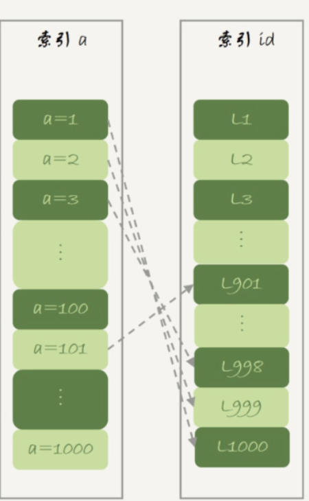

优化方式:

1. 根据索引 a 获取到的 id, 把 id 放入 read_rnd_buffer 中,
2. read_rnd_buffer 按递增排序
3. 到主键索引树查记录

使用配置

```
set optimizer_switch="mrr_cost_based=off"

```

稳定使用 MRR 优化

### Batched key Access

启用

```
set optimizer_switch='mrr=on,mrr_cost_based=off,batched_key_access=on';
```

从 t1 多拿几行 放入 join_buffer, 排序, 读 t2 获取顺序读取的性能提升

### BNL 优化

问题:

1. io 压力大
2. Buffer pool 污染

优化:

1. 增大 buffer_size
2. 增加索引
3. 使用带索引的临时表

```
create temporary table temp_t(id int primary key, a int, b int, index(b))engine=innodb;
insert into temp_t select * from t2 where b>=1 and b<=2000;
select * from t1 join temp_t on (t1.b=temp_t.b);

```

## 临时表

1. 使用 create tmporary table 建立临时表
2. 一个临时表只能被他当前 session 访问
3. 临时表可以和普通表同名
4. session 内有同名临时和普通表的时候, show create 和 增删改查操作的是临时表
5. show tables 看不到临时表

优势:

1. 不同 session 临时表可以重名
2. 不用担心数据异常, 会自动回收

### 在分表系统中应用

例如 查询语句为

```
select v from ht where k >= M order by t_modified desc limit 100;

```

且 k 不是分区字段

1. 使用 proxy

优点: 处理速度快
缺点: 内存运算 cpu 压力大 对复杂操作支持比较复杂

2. 把分库的数据 放到一个临时表内

执行流程: 1. 在每个分表上执行

    ```
    select v from ht where k >= M order by t_modified desc limit 100;
    ```

    2. 放入临时表

    3. 执行
    ```
    select v from ht order by t_modified desc limit 100;
    ```

### 临时表重名

```
create temporary table temp_t(id int primary key)engine=innodb;

```

当执行这个语句后, 会创建一个 _frm_ 文件, 前缀 #sql{进程 id}*{线程 id}*序列号 使用 select @@tmpdir 查看临时文件目录

mysql 建立表后, 对表管理 会 用 table_def_key 对应.

- 一个普通表的 table_def_key 由库名+表名 组成
- 临时表在普通表基础上加了 server_id 和 线程 id

遍历时优先遍历临时表

### 临时表使用场景

#### union

union 查询结果会放在临时表

#### group by

```
select id%10 as m, count(*) as c from t1 group by m;
```

explain 结果

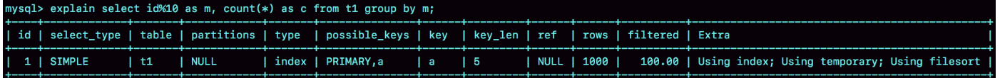

Extra 信息:

1. Using index 使用覆盖索引 不需要回表
2. Using temporay 使用临时表
3. Using filesort 需要排序

执行流程:

1. 创建临时表 字段 m,c, 主键 m
2. 扫描 t1 的索引 a, 取出叶子节点的 id 值, 计算结果 id %10, 计算为 x.
   - 如果临时表没有主键为 x 的值 插入,
   - 有的画把这一行的 c 加 1
3. 遍历完成根据 m 进行排序

```
select id%10 as m, count(\*) as c from t1 group by m order by null;
```

可以免去排序

通过

```
set tmp_table_size=1024;
```

设置临时表大小
超过大小会转成硬盘内存临时表

#### group by 优化

##### 索引

> 通过索引让扫描变得有序

如果输入如下:
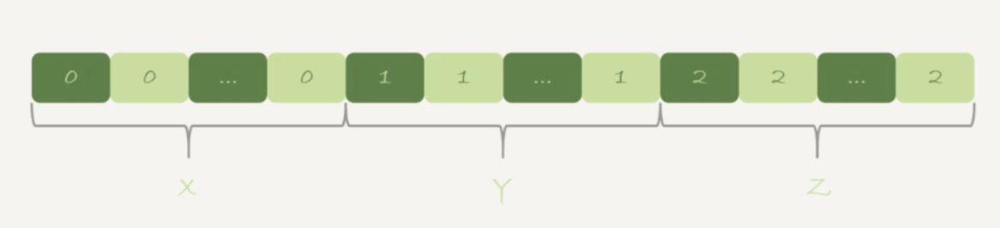

当 碰到第一个 1 的时候 知道已经积累了 X 个 0, 所以第一行为(0,X)

这样不需要额外的排序

```
alter table t1 add column z int generated always as(id % 100), add index(z);
```

新增一个 z 列, 在 z 列建立索引让它有序

```
select z, count(*) as c from t1 group by z;

```

##### 直接排序

1. 初始化 sort_buffer, 放入整形字段作为 m
2. 扫描表 t1, 把 id%10 放入
3. 排序
4. 得到
   

产生结果集

#### 临时表使用原则

1. 一边读数据, 一边得到结果不需要临时表, 临时表用来保存中间状态
2. join_buffer 是无序数组, sort_buffer 是有序数组, 临时表是二维表结构
3. 执行逻辑用到二维表特性(唯一索引, groub_by 要用一个字段计数)

#### 优化方法:

1. 无需排序使用 group by null
2. 让 group by 使用表的索引
3. 适当调大 tmp_table_size 放入内存中加速
4. 时候 SQL_BIG_RESULT 提示 mysql

## Meroy vs innodb

### 数据结构

innodb:
B+树

memory:
hash 表

组织方式:

- innodb 主键索引放的数据, 其他索引保存 id, 索引组织模式
- memory 索引上 保存数据位置 堆组织表

### 典型不同

1. innodb 是有序存放, memory 是插入顺序
2. 当数据文件存在空洞, innodb 不可以插入, memoey 可以见空就插入
3. 数据位置发生变化 innodb 修改主键索引即可, memory 需要修改所有索引
4. innodb 索引地位不同, memory 相同

### Memory B+Tree 优化

根据 memory 的特征, 进行范围查询的时候要进行全表扫描.

可以在 id 列上:

```sql
alter table t1 add index a_btree_index using btree (id);
```

会单独添加一个 B+Tree 索引

### 内存表的锁

内存表没有行锁, 只有表锁, 所以并发性能很差

### 持久化

数据放在内存中, 掉电就丢

在 M-S 架构下:

1. 业务正常访问主库
2. 重启, 内存表 t1 丢失,

_mysql 中 为了担心主备不一致, 重启后 会清空内存表数据_

不适用 Memory 的原因:

1. 并发性能差
2. 高 qps 下 innodb 有 buffer 性能不会太差

内存临时表可以使用 原因是没有并发问题

## 自增主键

### 自增主键保存

表的结构存在 .frm 文件中, 但不会保存自增建
不同的自增保存策略

1. myisam 保存在数据文件中

2. 5.7 之前 id 放在内存里 打开系统的时候 会找表里最大的 id 放入内存中

3. mysql 8.0 把 id 放入 redo log 里

### 自增修改机制

自增可以通过 auto_increment_offset 开始,以 auto_increment_incrment 作为步长

> 使用双写的时候 可以让一个为奇数 一个为偶数

修改时机是在准备插入的时候

### 自增修改时机

表结构如下

```sql
CREATE TABLE `t` (
  `id` int(11) NOT NULL AUTO_INCREMENT,
  `c` int(11) DEFAULT NULL,
  `d` int(11) DEFAULT NULL,
  PRIMARY KEY (`id`),
  UNIQUE KEY `c` (`c`)
) ENGINE=InnoDB;
```

### 自增空洞

1. 插入失败

2. 事务回滚

3. 批量插入 成倍申请

申请自增 id 会加锁

### 自增锁

通过 innodb_autoinc_lock_mode 参数 设置锁的模式

1. 当参数设置 0 时, 语句结束才释放锁
2. 当参数设置为 1 是:

- 普通 insert 自增锁申请后马上释放
- insert....select 执行后释放

3. 当参数设置为 3 时: 所有的动作都是申请后释放锁.

## insert

```sql
CREATE TABLE `t` (
  `id` int(11) NOT NULL AUTO_INCREMENT,
  `c` int(11) DEFAULT NULL,
  `d` int(11) DEFAULT NULL,
  PRIMARY KEY (`id`),
  UNIQUE KEY `c` (`c`)
) ENGINE=InnoDB;

insert into t values(null, 1,1);
insert into t values(null, 2,2);
insert into t values(null, 3,3);
insert into t values(null, 4,4);

create table t2 like t

```

执行这句

```
insert into t2(c,d)  (select c+1, d from t force index(c) order by c desc limit 1);

```

加锁 t 的 c 索引的 (3,4], (4, super] 和 主键 id=4

扫描一行

```
insert into t(c,d)  (select c+1, d from t force index(c) order by c desc limit 1);

```

> 区别是从自己读往自己插

流程:

1. 创建临时表
2. 根据 c 扫描 t 放入临时表
3. limit 1 返回结果

这个语句会导致, t 所有间隙加锁, 且全表扫描

优化

```sql
create temporary table temp_t(c int,d int) engine=memory;
insert into temp_t  (select c+1, d from t force index(c) order by c desc limit 1);
insert into t select * from temp_t;
drop table temp_t;
```

先插入到临时表 然后从临时表读数据

### 唯一索引冲突

唯一索引冲突时会给涉及到的 next-row key 加上锁

```
insert into t values(11,10,10) on duplicate key update d=100;
```

上述语句的影响行数为 2

## 复制 mysql 表

1. mysqldump 通过客户端执行 sql 语句
2. 把数据保存到服务器的一个 csv 文件中

```
select * from db1.t where a>900 into outfile '/server_tmp/t.csv';

```

在服务端执行

```
load data infile '/server_tmp/t.csv' into table db2.t;
```

这个执行的时候 会把文件内容写入 bin log 里

## 用户权限

```
create user 'ua'@'%' identified by 'pa';
```

使用该命令可以创建一个用户 ua 密码 pa

> mysql 不同 ip 的同名用户是一个不同用户

1. 磁盘上 mysql.users 插入一行, 权限字段都为 N
2. 内存中往 acl_users 插入 acl_user 对象, access 全部为 0

### 全局权限

```
grant all privileges on *.* to 'ua'@'%' with grant option;
```

使用该语句付给 user 最高权限, 操作:

1. 修改 mysql.users 权限
2. 修改 acl_users 权限设置

实际:

1. grant 修改全局权限 更新了磁盘和内存, 新的连接会采用这个权限
2. 一个已经存在的连接 不受到影响

使用

```
revoke all privileges on *.* from 'ua'@'%';

```

可以回收权限

### db 库表权限

```sql
grant all privileges on db1.* to 'ua'@'%' with grant option;

```

可以 给 ua 付给 db1 的所有权限, 动作:

1. 磁盘 mysql.db 中插入一条记录
2. 内存里 acl_dbs 中插入一条记录

### flush privileges

一般情况不使用

有时候会因为 内存的权限信息和硬盘的内存信息不同步
