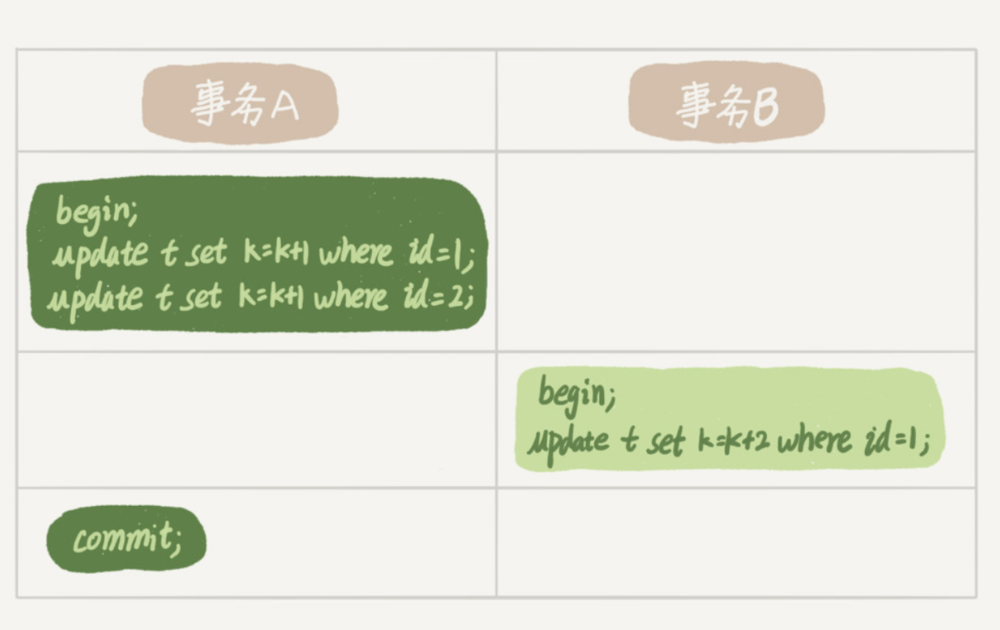

# Mysql 复习重点

> 以下内容来自极客时间

## 01 架构

组成可分为:

- 客户端
- 服务端：
  - 连接器
  - 分析器 (语法 词法)
  - 优化器 (执行计划)
  - 执行器
- 存储引擎

注意的问题:

- 权限获取发生在连接时
- show processlist 可查看连接状态
- 服务器根据 wait_timeout 断开客户端连接
- 分为长连接和短连接:
- 长连接 过多会导致 oom 原因 临时对象  只在连接断开释放:
  - 定时断开
  - mysql_reset_connection
- 不要使用查询缓存:
  - 更新操作会  失效该表所有查询缓存

## 02 日志

分为 redo log（重做日志）和 bin log(归档日志)

### redo log

类比赊账的黑板 临时缓存
有 write pos(当前可写入游标) 和 checkpoint(记录完毕可以删除)
由 innodb 提供

### 和 bin log 区别

- redo log 是物理日志 记录真实的物理修改 bin log 记录逻辑修改
- redo log 是循环写 bin log 是追加写
- redo log 保证 crash-safe bin log 不保证

### 二段式提交

先写入 redo log (prepare) 再写入 bin log 最后 commit 为了日志内容同步

### 备份恢复

恢复最近的全量 再根据日志恢复

### 参数

- innodb_flush_log_at_trx_commit 每次事务 redo 持久化磁盘 防止异常重庆的数据丢失
- sync_binlog 事务的 bin log 持久化到磁盘

## 事务

### 隔离级别

读未提交, 读提交, 可重复读, 串行化

> 使用 show variables like 'transaction_isolation' 查看隔离级别


- 读未提交: v1=2, v2=2, v3=2
- 读提交: v1=1, v2=2, v3=2
- 可重复读: v1=1 , v2=1, v3 =2

### 回滚原理

read_viewA -> read_viewB -> read_viewC

回归到 A 必须回滚 C -> B

存储很占资源

### 事务的启动

- 显示 begin commit rollback
- set autocommit = 0

建议使用 autocommit = 1 防止长链接造成 长事务

在 innodb_trx 查询事务

查询大于 60s 的事务

```
select * from information_schema.innodb_trx where TIME_TO_SEC(timediff(now(),trx_started))>60
```

### 避免长事务

1. 使用 autocommit = 1
2. SET MAX_EXECUTEION_TIME 控制最长执行时间
3. 监控 informatino_schema.innodb_trx 表

## 索引

innodb B+ 索引

### 主键索引(聚集索引) 和 普通索引(二级索引)

主键索引只查一次

普通索引先查到主键 再 回表 查主键索引

### 自增

在有序插入的前提下 不引起树的分裂 效率更高

> KV 场景可以不使用自增主键

## 常用索引的优化手段

### 覆盖索引

索引字段 覆盖了 查询索引 不需要回表

### 最左前缀原则

联合索引最左
字符串索引前几个字符

调整顺序维护索引

### 索引下推

5.6 以后版本
(name, age)

```
select * from people where name like '张%' and age = 10 and ismale =1
```

只能用 name 的索引 然后下推到 age 减少回表

> 使用 Alter table T engine=InnoDB 重建索引提高效率

## 锁

大致分为 全局锁, 表级锁, 行锁

### 全局锁

```
FLUSH tables with lock (FTWRL)
```

整个库只处于只读状态 一般用于备份

用 可重复读事务隔离级别 替代

```
mysqldump -single-transaction

```

不使用

```
set gloabal readonly = true

```

1. 可能影响 主从判断
2. 异常处理有问题

### 表锁

```
lock tables rad/write

unlokc tables
```

#### MDL(metadata lock)

对表做增删改时 加 mdl 读锁
对表结构变动时 加 mdl 写锁

读写 和 写之间互斥

給表加字段索引 会扫描全表

> 注意
> 对表结构做变更 可能导致会话拿不到读锁 卡死 客户端超时打爆数据库

解决方法

```
ALTER TABLE xxx WAIT N add colum
ALTER TABLE xxx NOWAIT add colum
```

### 行锁

这个过程中

事务 A 执行完 commit 之前 事务 B 会被阻塞 直到 A commit

> 如果事务中  需要锁多个行 把最可能造成冲突的语句往后放

例子:

影院系统: 1. 顾客 A 账户扣除票价 2. 影院 B 增加票价 3. 记录日志

正确顺序 3 1 2 (影院 B 的记录要多次更新)

### 死锁 和 死锁检测


A 等 B 释放 2 号行锁
B 等 A  释放 1 号行锁

> 解决方案

1. innodb_lock_wait_timeout 设置锁超时 有可能误伤
2. innodb_deadlock_detect on 死锁检测 O(n) 消耗大量 cpu 资源
   无法解决 热点行更新问题

> 热点行更新

1. 中间件 相同行更新排队 控制并发数量
2. 更新行分散 吧账户余额 分散到十行

## 事务隔离

### 快照实现

在 可重复读的隔离级别下 事务启动时会给整个数据库拍一个快照

每个事务开始的时候 会有个 transaction id

每一行数据有多个版本 每个版本有一个 row tx_id

语句更新会生成 undo log

回滚的时候 根据 undo log 计算

#### 快照生成

一个事务启动的时候 记录当前的启动的没提交的事务 trx_ids 最小值作为低水位,
当前系统事务 id 最大值+1 作为高水位


1. 落在绿色部分 说明是已经提交的事务可见
2. 落在红色部分 说明是将来的事务产生 不可见
3. 落在黄色的部分:
   - row tx_id 在 trx_ids 中 是由还未提交的事务产生
   - 不在 trx_ids 中 已经提交的事务 可见

对于一个事务的视图来说:

1. 自己的更新总是可见
2. 版本未提交不可见
3. 版本已提交 但在视图创建后提交 不可见
4. 版本已提交 在视图创建前 可见

更新时使用读当前机制, 加行锁读到最新的数据,更新完成后产生一个自己的版本

在 可重复读的级别下 事务开始创建视图 之后所有查询都用这个视图

在 读提交的级别下 每次执行都创建视图

## 唯一  索引 和 普通索引

innodb 数据页大小 16k 所以查询性能区别微乎其微

### change buffer

更新一个数据的时候 如果数据页在内存中 直接更新, 如果不在内存中 先写入 change buffer, 下次查询访问该数据页时, 讲数据页读入内存. 执行 change buffer 的操作

讲 change buffer 应用到原数据页的操作 称为 merge

以下情况会触发 merge:

1. 访问原数据页
2. 定期 merge
3. 数据库关闭

使用 change buffer 的情况:

1. 唯一索引因为要判断重复 所以必须读数据页 不能使用 change buffer
2. 普通索引可以

change buffer 使用 的是 buffer pool 的内存
通过

```
innodb_change_buffer_max_size
```

设置 change buffer 占用 buffer pool 的百分比

所以 唯一索引会影响**插入和更新**性能

#### 适用场景

change buffer 适用于写多读少的业务. 写入完了被马上访问的概率小(常见 日志 账单)

反过来  写完立刻读 change buffer 会起到副作用

所以 一般情况 尽量使用普通索引, 如果更新完了立刻查 要关闭 change buffer,
如果历史数据之类的东西 尽量开大机械硬盘

### 更新流程分析

```
mysql> insert into t(id,k) values(id1,k1),(id2,k2);

```


1. 对于 page1(id1)的插入 page1 再 buffer pool 直接插入
2. 对于 page2(id2)的插入 不在内存中 直接写入 change buffer
3. 记录 redo log

完成并且响应 然后后台更新 page1 和 change buffer

redo log 节约了随机写磁盘的消耗  转换成顺序写
change buffer 节约了随机读

注意 change buffer 会记录所有的真实的物理数据页写入  
redo log 会记录所有写入操作 有的写入到 change buffer 有的 写入到物理页,
所以 redo log commit 的时候 和 change buffer 不会冲突

## 选错索引

选择索引是优化器的工作

优化的目的是扫描行数

mysql 执行前不知道真实的扫描, 只能根据统计信息来估算 
这个统计信息称为区分度 一个索引上不同值越多 区分度越大.
一个索引不同值的数量 称为基数 cardinality
通过

```
show index from t
```

查看



注意 cardinality 不并不准确 通过采样统计 选择 N 个数据页 求平均值,
当更新行数 超过 1/M 会更新统计

通过 mysql _innodb_stats_persistent_ 可以设置 统计信息的存储方式  
on 时 会持久化 off 只在内存中

使用索引 要进行回表 优化器计算的时候 会把回表的代价算进去

使用以下命令 可以重新统计值

```
analyze table t;

```

### 案例分析

```
mysql> select * from t where (a between 1 and 1000)  and (b between 50000 and 100000) order by b limit 1;

```

这个语句应该用 a 索引 但是优化器选择了 b 索引 原因是优化器认为使用 b 可以避免排序

解决方案:

1. forceidnex
2. 修改语句 order by b,a
3. 删除 b 索引

## 字符串索引

1. 前缀索引

```
mysql> select
  count(distinct left(email,4)）as L4,
  count(distinct left(email,5)）as L5,
  count(distinct left(email,6)）as L6,
  count(distinct left(email,7)）as L7,
from SUser;

```

比对个长度前缀区分度

> 前缀索引会造成覆盖索引失效

2. 倒叙存储

用于身份证号 前缀相同 后缀不一样
```
mysql> select field_list from t where id_card = reverse('input_id_card_string');

```

3. hash字段

```
mysql> select field_list from t where id_card_crc=crc32('input_id_card_string') and id_card='input_id_card_string'

```

