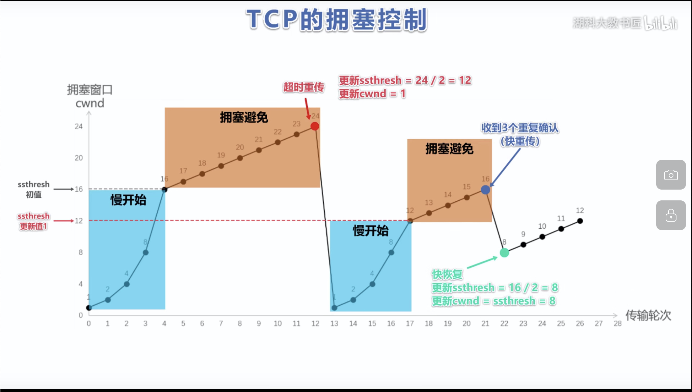

# 流量控制

通过滑动窗口:

1. 发送窗口 通过对端 接受窗口大小控制  rwnd
2. 0 窗口报文:
    1. 发送方不再发送 并且打开持续计时器
    2. 到期了发送 0 窗口探测报文
> 即使接受窗口为 0  也要接受 0窗口 确认 紧急数据

# 可靠传输

## 滑动窗口

* 发送方可根据拥塞情况, 缩小发送窗口
* 对于不安序到达的, 会缓存
* Tcp 要求接受方有累计确认 和 稍带确认.
    1. 累计确认尝试等待 多确认一个
    2. 捎带确认, 自己发数据的时候确认
    3. 确认不能推迟 0.5s 以上

## 超时重传

超时重传时间: 

* rtt 往返时间
* rto 超时重穿

利用每次测得的 rtt 加权计算 rtt (s)

RTTs =  (1 - a) * RTT(old) + a * RTT(new)

( 0 <= A  < 1) :

一般 a 取 0.125 表示新 RTT 对现在 RTT 影响

RTO 略大于 RTTS

```
RTO = RTT(s) + 4 * RTTD
RTTD = RTT1 / 2

newRTTD = (1-b) * RTTD + b * (RTT(s) - newRTT)

0 < b < 1:
 b = 0.25
```

### 测量 RTT

1. 方法一: 只要报文段重传就不采用 RTT
2. 方法二: 报文段每次重传 就 增大 RTO

## 拥塞控制

* 发送方维护拥塞滑动窗口 cwnd, 根据网络拥塞情况 动态调整
* 出现拥塞的依据是 发生重传
* 发送方维护 窗口和慢开始门限 ssthresh 
    1. cwnd < ssthresh 使用慢开始
    2. cwnd > ssthresh 使用拥塞避免算法

### 流程

1. 慢开始: 每次翻倍
2. 拥塞避免: 每次 + 1
3. 发生拥塞直接衰落到 1, 开始慢开始, 拥塞窗口是发生拥塞的窗口的一半


### 快重传算法

* 接受方立即发送确认
* 发送方接受到了三个重复确认 立刻重传


发送方收到了三个确认, 说明网络中只丢失了个别报文, 不启动慢开始, 而是快恢复, 从 ssthresh 开始 +1 恢复




# MTU 和 MSS

## MTU

查看
```
netstat -i
```

链路层最大

IP 数据包会分段

通过 Fragement offset 来偏移

## MSS

MSS TCP最大传输 , 可以通过网卡分片


