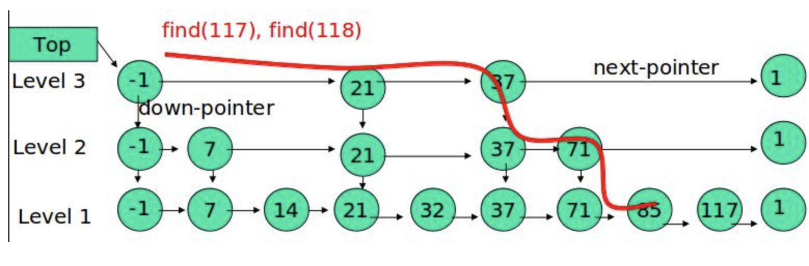

# redis

## 有趣源码的内部机制

### sds

#### embstr vs raw

因为一次分配的内存为 2 的整数倍, redisObject 16 字节, sds 3 字节 留下 44 字节 所以 44 字节以内直接 embstr 44 字节以上 再次分配空间 raw

### 字典

#### 基本结构

dict

```
struct dict {
    dictht ht[2] // 用于rehash
}
```

dictht

```
struct dictht {
    dictEntry** table; // 二维
    long size; // 第一维数组的长度
    long used; // hash 表中的元素个数
}
```

dictEntry

```
struct dictEntry {
    void* key;
    void* val;
    dictEntry* next; // 拉链防止冲突
}
```

### rehash

正常的 rehash 策略:

1. 为 h[1] 分配空间

   - 如果扩容大小等于第一个大于 ht[0].used 的 2 的 n 次方
   - 如果缩容 大小等于第一个大于等于 2 的 n 次方的数

2. 讲 h[0] 的数字 rehash 在 h[1]上
3. 清空 h[0]

渐进式 rehash:

因为 rehash 会阻塞整个 redis, 所以采用渐进式 rehash 进行操作:

1. 为 h[1]分配空间 并且设置 rehashidx 为 0
2. 每次操作 rehashidx + 1
3. 完成(used == 0) rehashidx 清空 s

在渐进 rehash 过程中, 字典的删除, 查找, 更新会在俩个 hash 表进行,
插入会插入到新的 hash 表中

### hash 攻击

利用 hash 函数的偏向性, 降低查询性能

> set 内部由 hash 表实现

## 跳跃表

节点

```c
struct zskiplistNode {
    struct zakiplistLevel {
        struct zskiplistNode *forward;
        unsigned int span; // 跨度 到达元素的路径长度也是元素的排名
    } level[];

    robj *obj;
    double score;
    zslnode* backward;
}
```

结构可参考


## zset

### 升级

升级 当存放元素编码变大时使用

## 压缩列表

```c
struct ziplist<T> {
    int32 zlbytes; // 整个压缩列表占用字节数
    int32 zltail_offset; // 最后一个元素距离压缩列表起始位置的偏移量，用于快速定位到最后一个节点
    int16 zllength; // 元素个数
    T[] entries; // 元素内容列表，挨个挨个紧凑存储
    int8 zlend; // 标志压缩列表的结束，值恒为 0xFF
}
```

```
struct entry {
    int<var> prevlen; // 前一个 entry 的字节长度
    int<var> encoding; // 元素类型编码
    optional byte[] content; // 元素内容
}
```

通过前一个元素的字节长度 指向前一个元素的地址 当前元素的大小通过 元素类型编码确定

### 级联更新

其中一个元素的 大小变大 或者 删除 要连锁更新之后的元素 复杂度 n2

## 对象

类型

```
TYPE key
```

可取值

```
REDIS_STRING  string
REDIS_LIST  list
REDIS_HASH   hash
REDIS_SET  set
REDIS_ZSET  zset
```

编码

OBJECT ENCODING msg

```
EDIS_ENCODING_INT 简单整数
xxx_EMBSTR  embstr
xxx_RAW  raw str
xxx_HT   字典
xxx_LINKEDLIST  双端链表
xxx_ZIPLIST   压缩列表
xxx_INTSET  整数集合
xxxx_SKIPLIST  跳跃表
```

### 内存回收

引用计数

### 共享内存

只共享整数值的字符串

### lru cache

## 数据库

### 过期

#### 设置过期

EXPIRE 设置过期
PEXPRIRE 设置过期 毫秒
EXPIREAT 设置过期时间点 秒级别时间戳
PREXIREAT 设置过期时间点 毫秒时间戳 s

过期的时间保存在 redisDb 的 expiires 字典

通过 PERSIST 移除过期时间

TTL 计算剩余时间
PTTL 计算剩余时间毫秒

#### 过期删除

redis 是 惰性删除 + 定期删除结合

## AOF RDB

rdb(快照) 存数据文件 (SAVE BGSAVE)
AOF 存操作指令
过期会向 AOF 写入 delete key

## 事件 (AE)

### 流程

eventLoop 运行 每次先阻塞执行 beforesleep 完成轮询 epoll 前的工作

```
void aeMain(aeEventLoop *eventLoop)
{
    eventLoop->stop = 0;
    while (!eventLoop->stop)
    {
        if (eventLoop->beforesleep != NULL)
            eventLoop->beforesleep(eventLoop);
        aeProcessEvents(eventLoop, AE_ALL_EVENTS | AE_CALL_AFTER_SLEEP);
    }
}
```

进入 aeProcessEvents

```c
int aeProcessEvents(aeEventLoop *eventLoop, int flags) {

        ....

        // 处理时间事件
        shortest = aeSearchNearestTimer(eventLoop); //最近的时间时间


        if (shortest) {
            long now_sec, now_ms;

            aeGetTime(&now_sec, &now_ms); // 获取当前时间
            tvp = &tv;

            /* How many milliseconds we need to wait for the next
             * time event to fire? */
            long long ms =
                (shortest->when_sec - now_sec)*1000 +
                shortest->when_ms - now_ms; // 更新时间

         ......

        }

        numevents = aeApiPoll(eventLoop, tvp); // 核心函数 获取触发事件 此处调用 epoll_wait 并且把触发的事件放回eventLoop

        // 调用回调
        if (eventLoop->aftersleep != NULL && flags & AE_CALL_AFTER_SLEEP)
            eventLoop->aftersleep(eventLoop);

        for (j = 0; j < numevents; j++) {
            aeFileEvent *fe = &eventLoop->events[eventLoop->fired[j].fd];
            int mask = eventLoop->fired[j].mask;
            int fd = eventLoop->fired[j].fd;
            int fired = 0;
            // 选取特定的读事件
            if (!invert && fe->mask & mask & AE_READABLE) {
                // 进行处理
                fe->rfileProc(eventLoop,fd,fe->clientData,mask);
                fired++;
            }

            // 选取特定的读事件
            if (fe->mask & mask & AE_WRITABLE) {
                if (!fired || fe->wfileProc != fe->rfileProc) {
                    fe->wfileProc(eventLoop,fd,fe->clientData,mask);
                    fired++;
                }
            }

            /* If we have to invert the call, fire the readable event now
             * after the writable one. */
            if (invert && fe->mask & mask & AE_READABLE) {
                if (!fired || fe->wfileProc != fe->rfileProc) {
                    fe->rfileProc(eventLoop,fd,fe->clientData,mask);
                    fired++;
                }
            }

            processed++;
        }
    }
    /* Check time events */
    if (flags & AE_TIME_EVENTS)
        processed += processTimeEvents(eventLoop);

    return processed;
}
```

FileEvent

```c
typedef struct aeFileEvent
{
    int mask; // 捕获的掩码 读/写
    aeFileProc *rfileProc;
    aeFileProc *wfileProc;
    void *clientData;
} aeFileEvent;
```

创建

```c
int aeCreateFileEvent(aeEventLoop *eventLoop, int fd, int mask,
        aeFileProc *proc, void *clientData)
{
    if (fd >= eventLoop->setsize) {
        errno = ERANGE;
        return AE_ERR;
    }
    aeFileEvent *fe = &eventLoop->events[fd];

    if (aeApiAddEvent(eventLoop, fd, mask) == -1) // 此处调用  epoll_ctl(state->epfd,op,fd,&ee)
        return AE_ERR;
    fe->mask |= mask;
    if (mask & AE_READABLE) fe->rfileProc = proc;
    if (mask & AE_WRITABLE) fe->wfileProc = proc;
    fe->clientData = clientData;
    if (fd > eventLoop->maxfd)
        eventLoop->maxfd = fd;
    return AE_OK;
}

```
